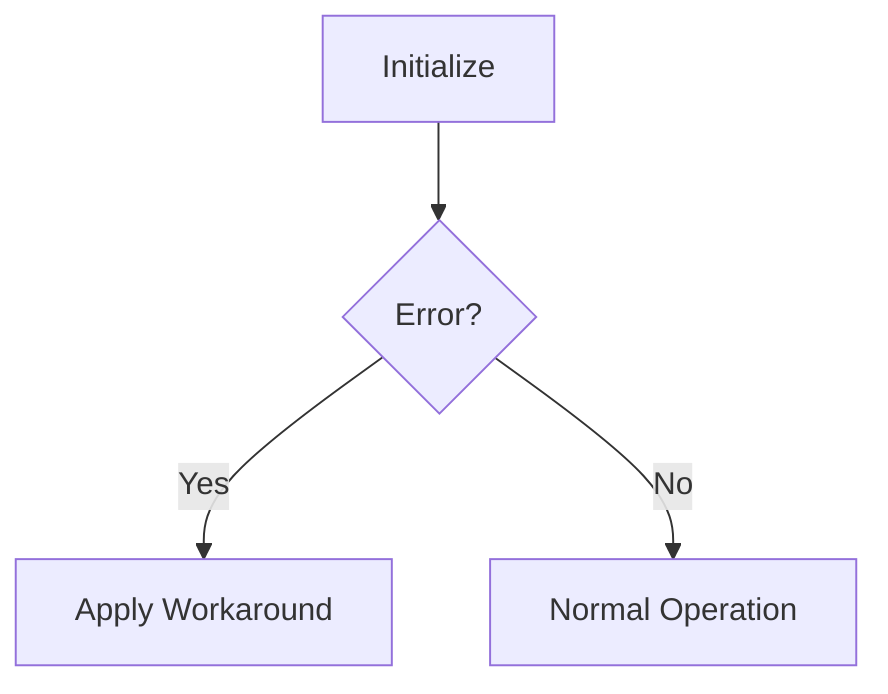

# Contributing to AT32F403A/407 Documentation

Thank you for your interest in improving this documentation! This guide will help you contribute effectively.

## 📋 Table of Contents

- [How to Contribute](#how-to-contribute)
- [Types of Contributions](#types-of-contributions)
- [Contribution Guidelines](#contribution-guidelines)
- [Pull Request Process](#pull-request-process)
- [Code of Conduct](#code-of-conduct)

---

## 🤝 How to Contribute

### 1. **Found an Error?**

Open an issue with:
- Section reference (e.g., "1.1.2.1 CAN Reception Failure")
- Description of the error
- Suggested correction (if possible)

### 2. **Have a Better Workaround?**

Submit a pull request with:
- Working code example
- Hardware tested on (AT32F403A/407, Rev A or B)
- Test conditions and results

### 3. **Want to Add Content?**

You can contribute:
- Practical examples
- Additional diagrams
- Translations
- Troubleshooting tips
- Migration guides

---

## 📝 Types of Contributions

### ✅ Welcome Contributions

1. **Improved Workarounds**
   - Alternative solutions to documented issues
   - More efficient implementations
   - Production-tested code

2. **Code Examples**
   - Complete, working examples
   - Real-world use cases
   - Integration examples

3. **Visual Improvements**
   - Additional Mermaid diagrams
   - Clarifying illustrations
   - Better tables

4. **Documentation Enhancements**
   - Clarifying explanations
   - Additional context
   - Cross-references

5. **Translations**
   - Chinese (中文)
   - Other languages

6. **Practical Guides**
   - Getting started tutorials
   - Migration from STM32
   - Debugging tips

### ❌ Not Accepted

1. **Content Changes Without Source**
   - Must match official Artery documentation
   - Cannot contradict official specifications

2. **Formatting-Only Changes**
   - Minor formatting tweaks without value
   - Personal style preferences

3. **Speculative Content**
   - Unverified workarounds
   - Untested code
   - Assumptions about future revisions

---

## 📏 Contribution Guidelines

### Code Examples

**Must include:**
```c
// Description: [What this code does]
// Issue Reference: [e.g., 1.1.2.1]
// Tested on: [AT32F403A/407, Revision A/B]
// Hardware: [e.g., AT32F407VGT7, Custom Board]

// Your code here with clear comments
```

**Requirements:**
- ✅ Compiles without errors
- ✅ Tested on real hardware
- ✅ Includes comments explaining logic
- ✅ Follows existing code style
- ✅ References specific issue numbers

### Markdown Formatting

**Follow existing style:**
- Use consistent heading levels
- Include code language tags: ` ```c `
- Use tables for comparisons
- Add issue references: `(1.1.2.1)`
- Use badges for status indicators

**Example:**
```markdown
### 1.1.2.1 CAN Reception Failure

**Status:** ❌ Not Fixed in Rev B  
**Priority:** 🔴 High  
**Workaround:** ✅ Available

**Description:**
[Your improved description here]
```

### Diagrams

**Mermaid diagrams:**
- Must render correctly on GitHub
- Include descriptive titles
- Use colors consistently
- Add legends when needed

**Example:**
```markdown

```

---

## 🔄 Pull Request Process

### 1. Fork & Clone

```bash
# Fork this repository on GitHub
# Then clone your fork:
git clone https://github.com/YOUR-USERNAME/at32-documentation.git
cd at32-documentation
```

### 2. Create Branch

```bash
# Create a descriptive branch name:
git checkout -b fix/can-reception-workaround
# or
git checkout -b add/flash-examples
# or
git checkout -b docs/troubleshooting-guide
```

### 3. Make Changes

- Edit the relevant `.md` file
- Test Mermaid diagrams render on GitHub
- Verify code examples compile
- Check links are not broken

### 4. Test Your Changes

**Preview Markdown:**
- Use VS Code with Markdown Preview
- Or view on GitHub after push to your fork

**Test Code:**
```bash
# Ensure code compiles (if applicable)
arm-none-eabi-gcc -mcpu=cortex-m4 -c your_example.c
```

### 5. Commit

```bash
git add .
git commit -m "fix(can): improve reception failure workaround

- Add Method 4 using interrupt-based approach
- Tested on AT32F407VGT7 Rev B
- Improves reliability in high-traffic scenarios

Resolves #123"
```

**Commit message format:**
```
<type>(<scope>): <subject>

<body>

<footer>
```

**Types:**
- `fix:` Bug fixes or workaround improvements
- `feat:` New features or content
- `docs:` Documentation improvements
- `style:` Formatting, no code change
- `refactor:` Code restructuring
- `test:` Testing improvements

### 6. Push & Create PR

```bash
git push origin fix/can-reception-workaround
```

Then create a Pull Request on GitHub with:

**Title:** Clear, descriptive summary  
**Description:**
```markdown
## Changes
- [Describe what you changed]

## Testing
- [How you tested this]
- Hardware: AT32F407VGT7, Rev B
- Test conditions: [describe]

## Issue Reference
Closes #123
```

### 7. Review Process

- Maintainers will review within 1 week
- Address any requested changes
- Once approved, PR will be merged

---

## ✅ Checklist Before Submitting

- [ ] Code compiles (if applicable)
- [ ] Tested on real hardware
- [ ] Markdown renders correctly
- [ ] Diagrams display properly
- [ ] Links are not broken
- [ ] No spelling errors
- [ ] Follows existing formatting
- [ ] Includes issue references
- [ ] Commit messages are clear
- [ ] PR description is complete

---

## 🎨 Style Guide

### Headings

```markdown
# H1 - Document Title (one per file)
## H2 - Major Sections (1.1.1)
### H3 - Subsections (Issue titles)
#### H4 - Details (Description, Workaround)
```

### Code Blocks

```markdown
```c
// Always specify language
void example_function(void) {
    // Include comments
}
```
```

### Tables

```markdown
| Column 1 | Column 2 | Column 3 |
|----------|----------|----------|
| Data     | Data     | Data     |
```

### Status Indicators

- ✅ Fixed/Available/Complete
- ❌ Not Fixed/Not Available
- ⚠️ Partial/Warning
- 🔴 High Priority
- 🟡 Medium Priority
- 🟢 Low Priority

---

## 🧪 Testing Requirements

### For Code Examples

1. **Compilation Test**
   ```bash
   arm-none-eabi-gcc -mcpu=cortex-m4 -mthumb -c example.c
   ```

2. **Hardware Test**
   - Test on AT32F403A or AT32F407
   - Document Revision (A or B)
   - Include test results

3. **Documentation**
   - Add comments explaining the code
   - Include usage instructions
   - Document limitations

### For Documentation Changes

1. **Markdown Validation**
   - Preview in GitHub
   - Check with markdownlint

2. **Link Validation**
   - Verify all internal links
   - Check external links

3. **Diagram Testing**
   - Mermaid renders on GitHub
   - Diagrams are readable

---

## 💬 Questions?

- **GitHub Issues:** For bugs or errors
- **GitHub Discussions:** For questions or ideas
- **Email:** [if provided]

---

## 📜 License

By contributing, you agree that your contributions will be licensed under the same terms as this project.

---

## 🙏 Thank You!

Your contributions help the entire AT32 developer community!

**Maintainers:**
- [@YourUsername](https://github.com/YourUsername)

**Contributors:**
- [List will be auto-generated]

---

**Last Updated:** November 10, 2024

