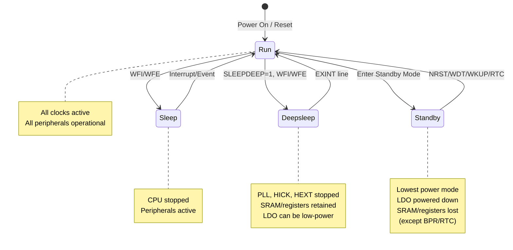
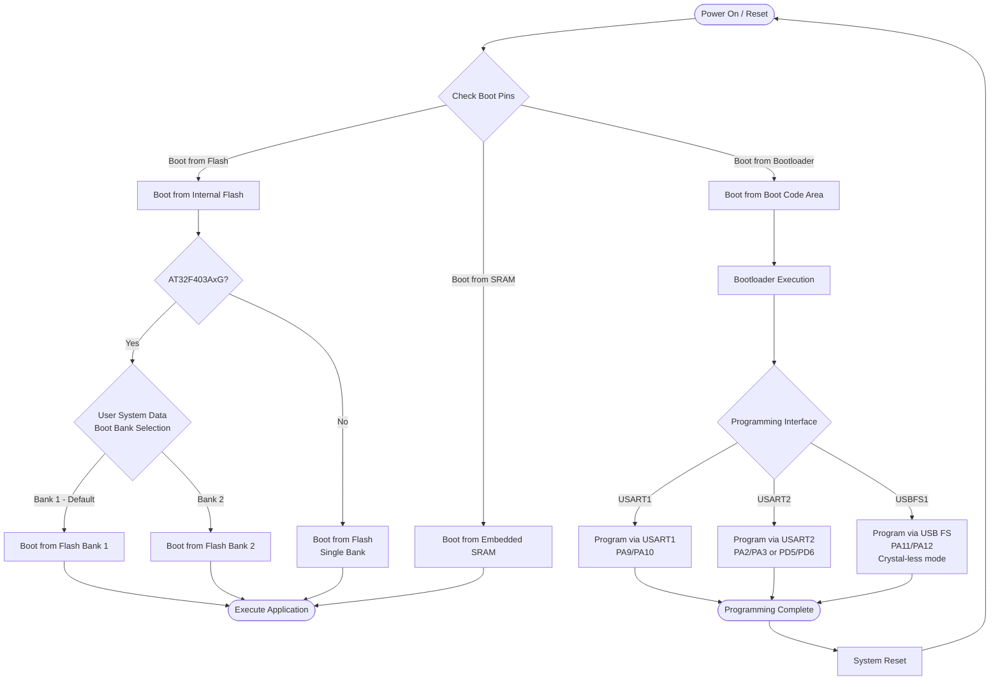
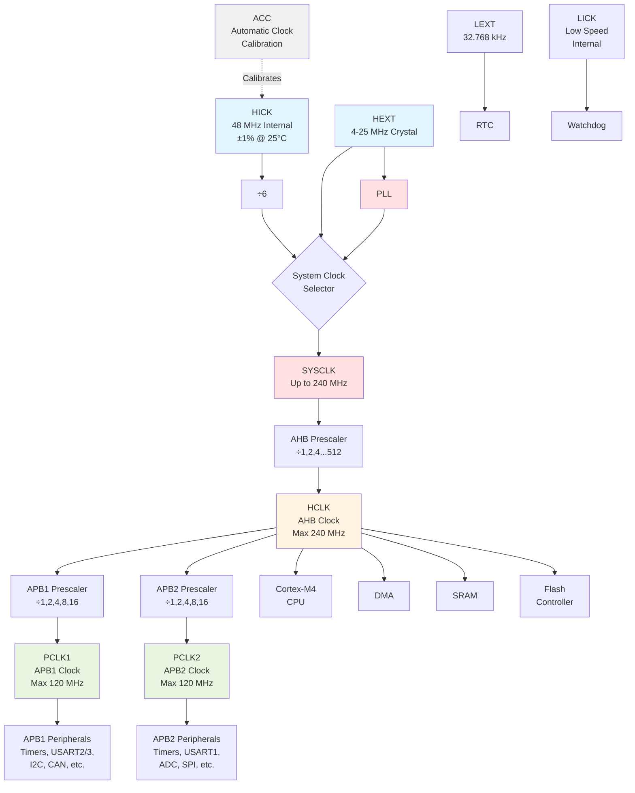
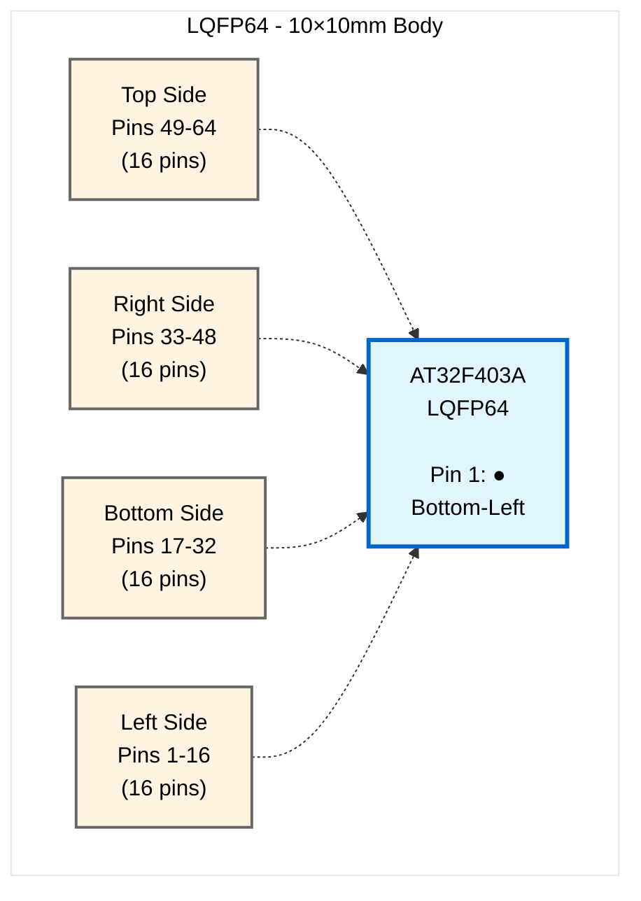
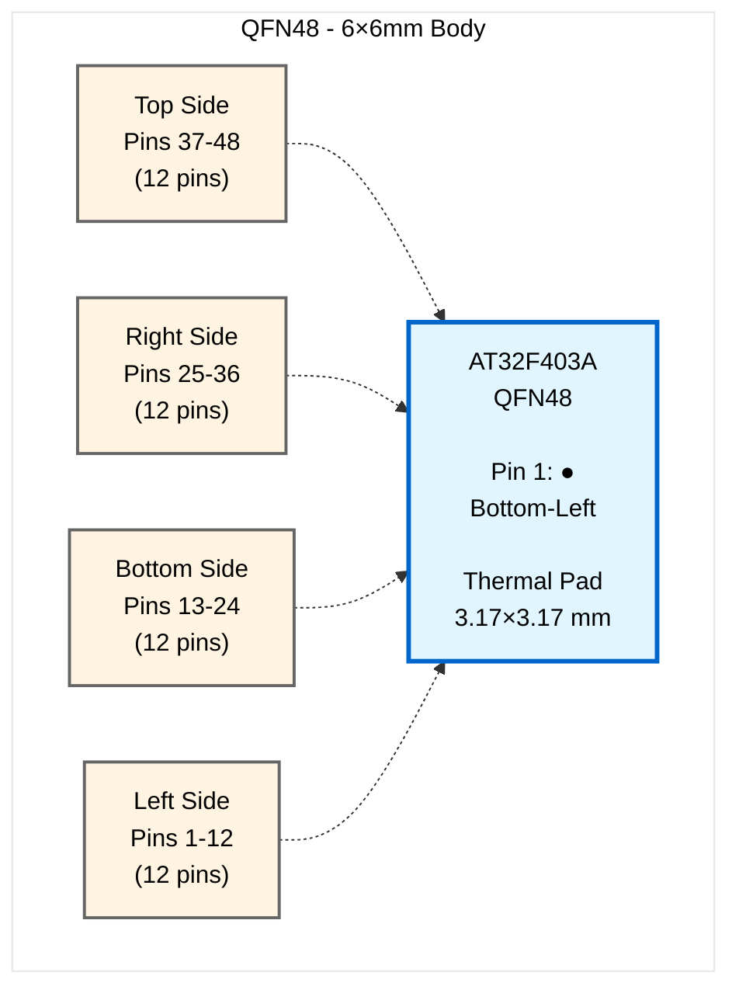

# AT32F403A Series Datasheet
## ARM® Cortex®-M4 MCU with 256KB to 1024KB Flash

**Version:** 2.04 | **Date:** 2023.10.17 | **Format:** Markdown

> ✅ **Production-Ready Documentation** - Complete technical datasheet converted from PDF to Markdown with enhanced navigation, searchability, and visual diagrams.

---

## Document Information

**Document Type:** ARM®-based 32-bit Cortex®-M4 MCU+FPU Datasheet  
**Target Platforms:** GitHub, Context7, MkDocs, PDF

## Overview

ARM®-based 32-bit Cortex®-M4 MCU+FPU with 256 to 1024 KB Flash, sLib, 17 timers, 3 ADCs, 20 communication interfaces (USBFS)

---

## Key Features

### Core: ARM® 32-bit Cortex®-M4 CPU with FPU
- 240 MHz maximum frequency, with a memory protection unit (MPU), single-cycle multiplication and hardware division
- Floating point unit (FPU) and DSP instructions

### Memories
- 256 to 1024 KBytes of internal Flash memory
- **sLib**: configurable part of main Flash set as a library area with code executable but secured, non-readable
- **SPIM interface**: Extra interfacing up to 16 Mbytes of the external SPI Flash (as instruction/data memory)
- Up to 96+128 KBytes of SRAM
- **External memory controller (XMC)** with 16-bit data bus. Supports multiplexed PSRAM/NOR and NAND memories
- XMC as LCD parallel interface, compatible with 8080/6800 modes

### Power Control (PWC)
- 2.6 to 3.6 V application supply
- Power on reset (POR), low voltage reset (LVR), and power voltage monitoring (PVM)
- Low power modes: Sleep, Deepsleep, and Standby modes
- VBAT supply for LEXT, RTC, and forty-two 16-bit battery powered registers (BPR)

### Clock and Reset Management (CRM)
- 4 to 25 MHz crystal (HEXT)
- 48 MHz internal factory-trimmed high speed internal clock (HICK), offering 1% accuracy at TA = 25°C and 2.5% accuracy at TA = -40 to +105°C, with automatic clock calibration (ACC)
- 32 kHz crystal (LEXT)
- Low speed internal clock (LICK)

### Analog
- 3 × 12-bit 2 MSPS A/D converters, up to 16 input channels
- Temperature sensor (VTS) and internal reference voltage (VINTRV)
- 2 × 12-bit D/A converters

### DMA
- 14-channel DMA controller

### Up to 80 Fast GPIOs
- All mappable on 16 external interrupts (EXINT)
- Almost all 5 V-tolerant

### Up to 17 Timers (TMR)
- Up to 2 × 16-bit motor control PWM advanced timers with dead-time generator and emergency brake
- Up to 8 × 16-bit + 2 × 32-bit timers, each with 4 IC/OC/PWM or pulse counter and quadrature encoder input
- 2 × 16-bit basic timers to drive the DAC
- 2 × watchdog timers (general WDT and windowed WWDT)
- SysTick timer: a 24-bit downcounter

### Up to 20 Communication Interfaces
- Up to 3 × I2C interfaces (SMBus/PMBus)
- Up to 8 × USARTs (ISO7816 interface, LIN, IrDA capability, modem control)
- Up to 4 × SPIs (50 Mbit/s), all with I2S interface multiplexed, I2S2/I2S3 support full-duplex
- Up to 2 × CAN interface (2.0B Active)
- USB 2.0 full speed interface supporting crystal-less
- Up to 2 × SDIO interfaces

### Additional Features
- CRC calculation unit, 96-bit unique ID (UID)

### Debug Mode
- Serial wire debug (SWD) and JTAG interfaces
- Cortex®-M4 Embedded Trace Macrocell (ETM™)

### Operating Conditions
- **Operating temperatures:** -40 to +105°C

### Packages
- **LQFP100**: 14 × 14 mm
- **LQFP64**: 10 × 10 mm
- **LQFP48**: 7 × 7 mm
- **QFN48**: 6 × 6 mm

---

## Device Summary

### Table 1. Device Summary

| Internal Flash | Part Numbers |
|----------------|--------------|
| **1024 KBytes** | AT32F403ACGT7, AT32F403ACGU7, AT32F403ARGT7, AT32F403AVGT7 |
| **512 KBytes** | AT32F403ACET7, AT32F403ACEU7, AT32F403ARET7, AT32F403AVET7 |
| **256 KBytes** | AT32F403ACCT7, AT32F403ACCU7, AT32F403ARCT7, AT32F403AVCT7 |

---

## 1. Descriptions

The AT32F403A series is based on the high-performance ARM®Cortex®-M4 32-bit RISC core operating at a frequency of up to 240 MHz. The Cortex®-M4 core features a Floating point unit (FPU) single precision which supports all ARM® single-precision data processing instructions and data types. It also implements a full set of DSP instructions and a memory protection unit (MPU) which enhances application security.

The AT32F403A series incorporates high-speed embedded memories (up to 1024 KBytes of internal Flash memory, 96+128 KBytes of SRAM), external SPI Flash (up to 16 MBytes addressing capability), and a wide range of enhanced GPIOs and peripherals connected to two APB buses. Any block of the embedded Flash memory can be protected by the "sLib" (security library), functioning as a security area with code-executable only.

The AT32F403A series offers three 12-bit ADC, two 12-bit DAC, eight general-purpose 16-bit timers plus two general-purpose 32-bit timers, and up to two PWM timers for motor control. It supports standard and advanced communication interfaces: up to three I2Cs, four SPIs (all multiplexed as I2Ss), two SDIOs, eight USARTs/UARTs, one USBFS, and two CANs.

The AT32F403A series operates in the -40 to +105°C temperature range, from a 2.6 to 3.6 V power supply. A comprehensive set of power-saving mode allows the design of low-power application.

The AT32F403A series offers devices in different package types. They are fully pin-to-pin, software and functionally compatible with the entire AT32F403A series devices, except that the configurations of peripherals are not completely identical, depending on the package types.

### Table 2. AT32F403A Features and Peripheral Counts

| Feature | AT32F403AxxU7 (QFN48) | AT32F403AxxT7 (LQFP48) | AT32F403AxxT7 (LQFP64) | AT32F403AxxT7 (LQFP100) |
|---------|:---------------------:|:----------------------:|:----------------------:|:-----------------------:|
| | **CC/CE/CG** | **CC/CE/CG** | **RC/RE/RG** | **VC/VE/VG** |
| **CPU Frequency (MHz)** | 240 | 240 | 240 | 240 |
| **Internal Flash<sup>(1)(2)</sup>** |
| ZW (KBytes) | 256/256/256 | 256/256/256 | 256/256/256 | 256/256/256 |
| NZW (KBytes) | 0/256/768 | 0/256/768 | 0/256/768 | 0/256/768 |
| Total (KBytes) | 256/512/1024 | 256/512/1024 | 256/512/1024 | 256/512/1024 |
| **SRAM<sup>(2)</sup> (KBytes)** | 96 + 128 | 96 + 128 | 96 + 128 | 96 + 128 |
| **SPIM<sup>(3)</sup>** | 1 ch / up to 16 MB | 1 ch / up to 16 MB | 1 ch / up to 16 MB | 1 ch / up to 16 MB |
| **XMC** | - | - | 1<sup>(4)</sup> | 1 |
| **Timers** |
| Advanced | 2 | 2 | 2 | 2 |
| 32-bit general-purpose | 2 | 2 | 2 | 2 |
| 16-bit general-purpose | 8 | 8 | 8 | 8 |
| Basic | 2 | 2 | 2 | 2 |
| SysTick | 1 | 1 | 1 | 1 |
| WDT | 1 | 1 | 1 | 1 |
| WWDT | 1 | 1 | 1 | 1 |
| RTC | 1 | 1 | 1 | 1 |
| **Communication Interfaces** |
| I2C | 3 | 3 | 3 | 3 |
| SPI<sup>(5)</sup> | 4 | 4 | 4 | 4 |
| I2S<sup>(5)</sup> | 4 (2 full-duplex) | 4 (2 full-duplex) | 4 (2 full-duplex) | 4 (2 full-duplex) |
| USART + UART | 3 + 4<sup>(6)</sup> | 3 + 4<sup>(6)</sup> | 4 + 4 | 4 + 4 |
| SDIO | 1<sup>(7)</sup> | 1<sup>(7)</sup> | 2 | 2 |
| USBFS device | 1 | 1 | 1 | 1 |
| CAN | 2 | 2 | 2 | 2 |
| **Analog** |
| 12-bit ADC (numbers/channels) | 3/10 | 3/10 | 3/16 | 3/16 |
| 12-bit DAC numbers | 2 | 2 | 2 | 2 |
| **GPIO** | 37 | 37 | 51 | 80 |
| **Operating Temperatures** | -40 to +105°C | -40 to +105°C | -40 to +105°C | -40 to +105°C |
| **Packages** | QFN48 (6×6 mm) | LQFP48 (7×7 mm) | LQFP64 (10×10 mm) | LQFP100 (14×14 mm) |

**Notes:**
1. **ZW** = zero wait-state, up to SYSCLK 240 MHz; **NZW** = non-zero wait-state
2. The internal Flash and SRAM sizes are configurable with User System Data. Take the AT32F403AVGT7 as an example, on which the Flash/SRAM can be configured into two options:
   - ZW: 256 KBytes, NZW: 768 KBytes, SRAM: 96 KBytes
   - ZW: 128 KBytes, NZW: 896 KBytes, SRAM: 224 KBytes
3. **SPIM** = External four-wire SPI Flash memory extension (for program execution/data storage with encryption capability)
4. For LQFP64 package, XMC only supports the LCD panel with 8-bit mode
5. I2S shares the same pin with SPI
6. For LQFP48 and QFN48 packages, UART8 is not available and USART6 is used as UART for no CK pin
7. For LQFP48 and QFN48 packages, only SDIO2 exists and supports maximum 4-bit (D0~D3) mode

## 2. Functional Overview

### 2.1 ARM® Cortex®-M4 with FPU

The ARM®Cortex®-M4 processor is the latest generation of ARM® processors for embedded systems. It is a 32-bit RISC processor featuring exceptional code efficiency, outstanding computing power and advanced response to interrupts. The processor supports a set of DSP instructions which enable efficient signal processing and complex algorithm execution. Its single precision FPU (floating point unit) speeds up floating point calculation while avoiding saturation. Figure 1 shows the general block diagram of the AT32F403A.

#### Figure 1. AT32F403A System Block Diagram

```mermaid
graph TB
    subgraph CORE["ARM® Cortex®-M4 Core System"]
        CPU["Cortex-M4 CPU<br/>240 MHz<br/>FPU + DSP"]
        NVIC["NVIC<br/>Interrupt Controller"]
        MPU["MPU<br/>Memory Protection"]
        SysTick["SysTick<br/>24-bit Timer"]
        Debug["Debug<br/>SWD/JTAG/ETM"]
    end
    
    subgraph BUSMATRIX["AHB Bus Matrix (HCLK up to 240 MHz)"]
        BusCtrl["Bus Arbiter<br/>& Matrix"]
    end
    
    subgraph MEMORY["Memory Subsystem"]
        FlashCtrl["Flash Controller"]
        Flash["Internal Flash<br/>256KB - 1024KB<br/>(ZW + NZW)"]
        SRAM["SRAM<br/>224KB<br/>(96KB + 128KB)"]
        BootROM["Boot ROM<br/>18KB<br/>Bootloader"]
        SPIM["SPIM Controller<br/>SPI Flash Interface<br/>up to 16MB"]
        XMC["XMC Controller<br/>External Memory<br/>PSRAM/NOR/NAND/LCD"]
    end
    
    subgraph DMA_SYS["DMA System"]
        DMA1["DMA1<br/>7 Channels"]
        DMA2["DMA2<br/>7 Channels"]
    end
    
    subgraph APB2_BUS["APB2 Bus (PCLK2 up to 120 MHz)"]
        APB2Bridge["APB2<br/>Bridge"]
        
        subgraph APB2_TIM["Advanced/General Timers"]
            TMR1["TMR1<br/>Advanced<br/>16-bit"]
            TMR8["TMR8<br/>Advanced<br/>16-bit"]
            TMR9_14["TMR9-14<br/>General<br/>16-bit"]
        end
        
        subgraph APB2_COM["High-Speed Communication"]
            USART1["USART1"]
            USART6["USART6"]
            SPI1_4["SPI1-4<br/>I2S1-4<br/>up to 50 Mbps"]
            SDIO["SDIO1/2<br/>SD/MMC<br/>up to 48 MHz"]
        end
        
        subgraph APB2_ADC["Analog"]
            ADC["ADC1-3<br/>12-bit<br/>2 MSPS"]
        end
    end
    
    subgraph APB1_BUS["APB1 Bus (PCLK1 up to 120 MHz)"]
        APB1Bridge["APB1<br/>Bridge"]
        
        subgraph APB1_TIM["General/Basic Timers"]
            TMR2_5["TMR2-5<br/>General<br/>16/32-bit"]
            TMR6_7["TMR6-7<br/>Basic<br/>16-bit"]
        end
        
        subgraph APB1_COM["Standard Communication"]
            USART2_3["USART2-3"]
            UART["UART4-5<br/>UART7-8"]
            I2C["I2C1-3<br/>up to 1 MHz"]
            CAN["CAN1-2<br/>2.0B Active"]
            USB["USBFS<br/>USB 2.0 FS<br/>Crystal-less"]
        end
        
        subgraph APB1_OTHER["Other Peripherals"]
            DAC["DAC<br/>2ch 12-bit<br/>1 MSPS"]
            RTC["RTC<br/>Calendar/Alarm"]
            WDT["WDT/WWDT<br/>Watchdog"]
            CRC["CRC Unit"]
        end
    end
    
    subgraph GPIO_SYS["GPIO & External Interfaces"]
        GPIO["GPIO Ports<br/>PA-PE<br/>up to 82 I/Os<br/>5V-tolerant"]
        EXINT["EXINT<br/>16 External<br/>Interrupt Lines"]
    end
    
    subgraph CLOCK_SYS["Clock Management (CRM)"]
        HEXT["HEXT<br/>4-25 MHz<br/>Crystal"]
        HICK["HICK<br/>48 MHz ±1%<br/>Internal RC"]
        LEXT["LEXT<br/>32.768 kHz<br/>RTC Crystal"]
        LICK["LICK<br/>40 kHz<br/>Internal RC"]
        PLL["PLL<br/>×2 to ×64<br/>up to 500 MHz"]
        ACC["ACC<br/>Auto Clock<br/>Calibration"]
        ClockTree["Clock Tree<br/>Prescalers<br/>& Muxes"]
    end
    
    subgraph POWER_SYS["Power Management (PWC)"]
        LDO["LDO Regulator<br/>Normal/LP Mode"]
        POR["POR/LVR<br/>Reset"]
        PVD["PVD<br/>7 Thresholds"]
        VBAT_DOM["VBAT Domain<br/>RTC + BPR<br/>42×16-bit Regs"]
    end
    
    %% Core connections
    CPU --> NVIC
    CPU --> MPU
    CPU --> SysTick
    CPU --> Debug
    
    %% Core to Bus
    CPU --> BusCtrl
    NVIC --> BusCtrl
    
    %% Memory connections
    BusCtrl --> FlashCtrl
    FlashCtrl --> Flash
    FlashCtrl --> BootROM
    BusCtrl --> SRAM
    BusCtrl --> SPIM
    BusCtrl --> XMC
    
    %% DMA connections
    BusCtrl --> DMA1
    BusCtrl --> DMA2
    DMA1 -.->|DMA Requests| APB1Bridge
    DMA1 -.->|DMA Requests| APB2Bridge
    DMA2 -.->|DMA Requests| APB1Bridge
    DMA2 -.->|DMA Requests| APB2Bridge
    
    %% APB2 Bridge and peripherals
    BusCtrl --> APB2Bridge
    APB2Bridge --> TMR1
    APB2Bridge --> TMR8
    APB2Bridge --> TMR9_14
    APB2Bridge --> USART1
    APB2Bridge --> USART6
    APB2Bridge --> SPI1_4
    APB2Bridge --> SDIO
    APB2Bridge --> ADC
    
    %% APB1 Bridge and peripherals
    BusCtrl --> APB1Bridge
    APB1Bridge --> TMR2_5
    APB1Bridge --> TMR6_7
    APB1Bridge --> USART2_3
    APB1Bridge --> UART
    APB1Bridge --> I2C
    APB1Bridge --> CAN
    APB1Bridge --> USB
    APB1Bridge --> DAC
    APB1Bridge --> RTC
    APB1Bridge --> WDT
    APB1Bridge --> CRC
    
    %% GPIO connections
    BusCtrl --> GPIO
    GPIO --> EXINT
    EXINT --> NVIC
    
    %% Clock system
    HEXT --> PLL
    HICK --> PLL
    HICK --> ACC
    ACC -.->|Calibration| HICK
    PLL --> ClockTree
    HEXT --> ClockTree
    HICK --> ClockTree
    ClockTree --> BusCtrl
    ClockTree --> APB1Bridge
    ClockTree --> APB2Bridge
    LEXT --> RTC
    LICK --> WDT
    
    %% Power system
    LDO --> BusCtrl
    POR --> CPU
    PVD -.->|Interrupt| NVIC
    VBAT_DOM --> RTC
    
    %% External connections
    XMC -.->|Address/Data| EXT_MEM["External Memory<br/>PSRAM/NOR/NAND"]
    SPIM -.->|SPI| EXT_FLASH["External<br/>SPI Flash"]
    GPIO -.->|I/O Pins| EXTERNAL["External<br/>Peripherals<br/>& Signals"]
    
    %% Styling
    classDef coreStyle fill:#e1f5ff,stroke:#0066cc,stroke-width:2px
    classDef memStyle fill:#fff3e1,stroke:#ff9900,stroke-width:2px
    classDef busStyle fill:#f0f0f0,stroke:#666,stroke-width:2px
    classDef periphStyle fill:#e8f5e1,stroke:#009900,stroke-width:2px
    classDef clockStyle fill:#ffe1e1,stroke:#cc0000,stroke-width:2px
    classDef powerStyle fill:#f5e1ff,stroke:#9900cc,stroke-width:2px
    
    class CPU,NVIC,MPU,SysTick,Debug coreStyle
    class Flash,SRAM,BootROM,FlashCtrl,SPIM,XMC memStyle
    class BusCtrl,APB1Bridge,APB2Bridge busStyle
    class TMR1,TMR8,TMR9_14,TMR2_5,TMR6_7,USART1,USART6,USART2_3,UART,SPI1_4,I2C,CAN,USB,SDIO,ADC,DAC,RTC,WDT,CRC,DMA1,DMA2,GPIO,EXINT periphStyle
    class HEXT,HICK,LEXT,LICK,PLL,ACC,ClockTree clockStyle
    class LDO,POR,PVD,VBAT_DOM powerStyle
```



**Block Diagram Legend:**

| Color | Component Type |
|-------|---------------|
| 🔵 Light Blue | Core System (CPU, FPU, NVIC, MPU, Debug) |
| 🟡 Light Orange | Memory Subsystem (Flash, SRAM, Controllers) |
| ⚪ Gray | Bus Infrastructure (AHB, APB bridges) |
| 🟢 Light Green | Peripherals (Timers, Communication, DMA, GPIO) |
| 🔴 Light Red | Clock System (Oscillators, PLL, Clock Tree) |
| 🟣 Light Purple | Power Management (LDO, Reset, VBAT domain) |

**Key Architecture Features:**

- **High-Performance Core**: ARM® Cortex-M4 with FPU running at up to 240 MHz
- **Flexible Memory**: Up to 1024KB internal Flash + 224KB SRAM + external memory support
- **Rich Connectivity**: 20+ communication interfaces (USART, SPI, I2C, CAN, USB, SDIO)
- **Advanced Peripherals**: 17 timers, 3×12-bit ADC, 2×12-bit DAC, 14-channel DMA
- **Multi-Bus Architecture**: AHB for high-speed, dual APB (APB1/APB2) for peripherals
- **Robust Clock System**: Multiple oscillators with PLL and automatic calibration
- **Low-Power Design**: Multiple power modes with VBAT backup domain


### 2.2 Memory

#### 2.2.1 Internal Flash Memory

Up to 1024 KBytes of embedded Flash is available for storing programs and data. Any part of the embedded Flash memory can be protected by the sLib (security library), a security area that is code-executable only but non-readable. "sLib" is a mechanism designed to protect the intelligence of solution vendors and facilitate the second-level development by customers.

Additionally, there is an external four-wire SPI Flash memory interface available for accessing up to 16MB. The external SPI Flash memory is used as an extended Flash memory bank 3. Ciphertext protection feature is also supported. Therefore it is possible to select whether to encrypt data by setting the user system data. The range to be encrypted is configured through the corresponding register.

There is another 18-KByte boot code area in which the bootloader is stored.

A User System Data block is included, which is used to configure the hardware behaviors such as read/erase/write protection and watchdog self-enable. User System Data allows to set erase/write and read protection individually.

#### 2.2.2 Memory Protection Unit (MPU)

The memory protection unit (MPU) is used to manage the CPU accesses to memory to prevent one task to accidentally corrupt the memory or resources used by any other active task. This memory area consists of up to 8 protected areas that can in turn be divided up into 8 subareas. The protection area sizes are between 32 bytes and the entire 4 gigabytes of addressable memory.

The MPU is especially suited to the applications where some critical or certified code has to be protected against the misbehavior of other tasks. It is usually managed by an RTOS (real-time operating system).

#### 2.2.3 Embedded SRAM

The device offers up to 224 KBytes of embedded SRAM that is accessible (read/write) at CPU clock speed with 0 wait states.

#### 2.2.4 External Memory Controller (XMC)

The XMC is embedded in the AT32F403A. It has two Chip Select outputs supporting the following modes: multiplexed PSRAM/NOR and 16-bit/8-bit NAND memory.

**Main features:**
- Write buffer area
- Code execution from external memory of the multiplexed PSRAM/NOR

The XMC can be configured to interface with most graphic LCD controllers. It supports the Intel 8080 and Motorola 6800 modes.

### 2.3 Interrupts

#### 2.3.1 Nested Vectored Interrupt Controller (NVIC)

The AT32F403A embeds a nested vectored interrupt controller able to manage 16 priority levels and handle maskable interrupt channels plus the 16 interrupt lines of the Cortex®-M4 core. This hardware block provides flexible interrupt management features with minimal interrupt latency.

#### 2.3.2 External Interrupts (EXINT)

The external interrupt (EXINT), which is connected directly with NVIC, consists of 19 edge detector lines used to generate interrupt requests. Each line can be independently configured to select the trigger event (rising edge, falling edge, both) and can be masked independently. A pending register maintains the status of the interrupt requests. The external interrupt lines connect to up to 16 GPIOs.

### 2.4 Power Control (PWC)

#### 2.4.1 Power Supply Schemes

- **VDD = 2.6~3.6 V**: External power supply for GPIOs and the internal block such as regulator (LDO), provided externally through VDD pins.
- **VDDA = 2.6~3.6 V**: External analog power supplies for ADC and DAC. VDDA and VSSA must be the same voltage potential as VDD and VSS, respectively.
- **VBAT = 1.8~3.6 V**: Power supply for VBAT domain through the external battery or super capacitor, or from VDD when the external battery or super capacitor is not present. The VBAT (through power switch) supplies for RTC, external crystal 32 kHz (LEXT), and battery powered registers (BPR) when VDD is not present.

#### 2.4.2 Reset and Power Voltage Monitoring (POR / LVR / PVM)

The device has an integrated power-on reset (POR)/low voltage reset (LVR) circuitry. It is always active, and allows proper operation starting from/down to 2.6 V. The device remains in reset mode when VDD is below a specified threshold (VLVR) without the need for an external reset circuit.

The device features an embedded power voltage monitor (PVM) that monitors the VDD power supply and compares it to the VPVM threshold. An interrupt can be generated when VDD drops below the VPVM threshold and/or when VDD rises above the VPVM threshold. The PVM is enabled by software.

#### 2.4.3 Voltage Regulator (LDO)

The LDO has three operation modes: normal mode, low-power mode, and power down mode.

- **Normal mode**: It is used in Run/Sleep mode and in the Deepsleep mode
- **Low-power mode**: It can be used in the Deepsleep mode
- **Power down mode**: It is used in Standby mode. The LDO output is in high impedance and the kernel circuitry is powered down but the contents of the registers and SRAM are lost.

This LDO operates always in its normal mode after reset.

#### 2.4.4 Low-Power Modes

The AT32F403A supports three low-power modes:

**Sleep Mode**  
In Sleep mode, only the CPU is stopped. All peripherals continue to operate and can wake up the CPU when an interrupt/event occurs.

**Deepsleep Mode**  
Deepsleep mode achieves the lowest power consumption while retaining the content of SRAM and registers. All clocks in the LDO domain are stopped, disabling the PLL, the HICK clock, and the HEXT crystal oscillator. The voltage regulator can also be put in normal or low-power mode.

The device can be woken up from Deepsleep mode by any of the EXINT line. The EXINT line source can be one of the 16 external lines, the PVM output, the RTC alarm, or the USBFS wakeup.

**Standby Mode**  
The Standby mode is used to achieve the lowest power consumption. The internal voltage regulator is switched off so that the entire LDO domain is powered off. The PLL, the HICK clock and the HEXT crystal oscillator are also switched off. After entering Standby mode, SRAM and register contents are lost except for registers in the BPR domain, RTC domain and Standby circuitry.

The device leaves Standby mode when an external reset (NRST pin), a WDT reset, a rising edge on the WKUP pin, or an RTC alarm occurs.

**Note:** The RTC and the corresponding clock sources are not stopped by entering Deepsleep or Standby mode. WDT depends on User System Data setting.

#### Power Modes State Diagram



### 2.5 Boot Modes

At startup, boot pins are used to select one of three boot options:

- Boot from the internal Flash memory. For the AT32F403AxG, user has an option to boot from any of two memory banks. By default, boot from Flash memory Bank 1 is selected. User can also choose to boot from Flash memory Bank 2 using the User System Data
- Boot from boot code area
- Boot from embedded SRAM

The bootloader is stored in boot code area. It is used to reprogram the Flash memory through USART1, USART2, or USBFS1. Of them, the USBFS1 supports crystal-less mode. If SPIM_IO0/1 pin is configured to be shared with USBFS1 pin, the SPIM Flash memory Bank 3 cannot be programmed through USBFS1. Table 3 presents AT32F403A pin configurations relative to Bootloader.

#### Table 3. Bootloader Supporting Part Numbers and Pin Configurations

| Interface | Part Number | TX Pin | RX Pin |
|-----------|-------------|--------|--------|
| **USART1** | All part numbers | PA9 | PA10 |
| **USART2** | AT32F403AVGT7 | PD5 (remapped) | PD6 (remapped) |
| **USART2** | All others | PA2 | PA3 |
| **USBFS1** | All part numbers | PA11 (D-) | PA12 (D+) |

**Notes:**
- USART1 is available on all AT32F403A part numbers
- USART2 uses different pins depending on device variant
- USBFS1 supports crystal-less mode for in-system programming
- All bootloader interfaces support Flash reprogramming

#### Boot Mode Selection Flowchart



### 2.6 Clocks

On reset, the internal 48 MHz clock (HICK) divided by 6 (that is 8 MHz) is selected as default CPU clock after any reset. The application can select an external 4 to 25 MHz clock (HEXT) as a system clock. This clock can be monitored for failure. If failure is detected, HEXT will be switched off and the system automatically switches back to the internal HICK. A software interrupt is generated. Similarly, the system takes the same action once HEXT fails when it is used as the source of PLL.

Several prescalers are available to allow the configuration of the AHB and the APB (APB1 and APB2) frequency. The maximum frequency of the AHB domain is 240 MHz. The maximum allowed frequency of the APB domain is 120 MHz.

The AT32F403A embeds an automatic clock calibration (ACC) block, which calibrates the internal 48 MHz HICK clock, assuring the most precise accuracy of the HICK in the full range of the operating temperatures.

#### Clock System Architecture



### 2.7 General-Purpose Inputs / Outputs (GPIOs)

Each of the GPIO pins can be configured by software as output (push-pull or open-drain), as input (with or without pull-up or pull-down), or as multiple function. Most of the GPIO pins are shared with digital or analog multiple functions. All GPIOs are high current-capable.

The GPIO's configuration can be locked, if needed, in order to avoid spurious writing to the GPIO's registers by following a specific sequence.

### 2.8 Remap Capability

This feature allows the use of a maximum number of peripherals in a given application. Indeed, multiple functions are available not only on the default pins but also on other specific pins onto which they are remappable. This has the advantage of making board design and port usage much more flexible.

For details refer to Table 6; it shows the list of remappable multiple functions and the pins onto which they can be remapped. See the AT32F403A reference manual for software considerations.

### 2.9 Direct Memory Access Controller (DMA)

The device features two general-purpose dual-port DMAs (7 channels for DMA1 and 7 channels for DMA2). They are able to manage memory-to-memory, peripheral-to-memory, and memory-to-peripheral transfers. These two DMA controllers support circular buffer management, removing the need for user code intervention when the controller reaches the end of the buffer.

Each channel is connected to dedicated hardware DMA requests, with support for software trigger on each channel. Configuration is made by software and transfer sizes between source and destination are independent.

The DMA can be used with the main peripherals: SPI, I2C, USART, advanced, general-purpose, and basic timers TMRx, DAC, I2S, SDIO, and ADC.

### 2.10 Timers (TMR)

The AT32F403A device includes two advanced timers, ten general-purpose timers, two basic timers and a SysTick timer.

#### Table 4. Timer Feature Comparison

| Timer | Counter Resolution | Counter Type | Prescaler Factor | DMA Request Generation | Capture/Compare Channels | Complementary Outputs |
|-------|-------------------|--------------|------------------|----------------------|-------------------------|---------------------|
| TMR1, TMR8 | 16-bit | Up, down, up/down | Any integer between 1 and 65536 | Yes | 4 | Yes |
| TMR2, TMR5 | 16-bit or 32-bit | Up, down, up/down | Any integer between 1 and 65536 | Yes | 4 | No |
| TMR3, TMR4 | 16-bit | Up, down, up/down | Any integer between 1 and 65536 | Yes | 4 | No |
| TMR9, TMR12 | 16-bit | Up | Any integer between 1 and 65536 | No | 2 | No |
| TMR10, TMR11, TMR13, TMR14 | 16-bit | Up | Any integer between 1 and 65536 | No | 1 | No |
| TMR6, TMR7 | 16-bit | Up | Any integer between 1 and 65536 | Yes | 0 | No |

#### 2.10.1 Advanced Timers (TMR1 and TMR8)

The two advanced timers (TMR1 and TMR8) can each be seen as three-phase PWM generators multiplexed on 6 channels. They have complementary PWM outputs with programmable dead-time insertion. They can also be seen as a complete general-purpose timer. Their four independent channels can be used for:

- Input capture
- Output compare
- PWM generation (edge or center-aligned modes)
- One-cycle mode output

If configured as a standard 16-bit timer, it has the same features as the TMRx timer. If configured as the 16-bit PWM generator, it has full modulation capability (0-100%).

In debug mode, the advanced timer counter can be frozen and the PWM outputs disabled to turn off any power switch driven by these outputs.

Many features are shared with those of the general-purpose TMR which have the same architecture. The advanced timer can therefore work together with the general-purpose timers via the timer link feature for synchronization or event chaining.

#### 2.10.2 General-Purpose Timers (TMRx)

There are 10 synchronizable general-purpose timers embedded in the AT32F403A series.

**TMR2, TMR3, TMR4, and TMR5**  
The AT32F403A has 4 full-featured general-purpose timers: TMR2, TMR3, TMR4, and TMR5. The TMR2 and TMR5 timers are based on a 32-bit auto-reload up/down counter and a 16-bit prescaler. The TMR3 and TMR4 timers are based on a 16-bit auto-reload up/down counter and a 16-bit prescaler. They can offer four independent channels on the largest package. Each channel can be used for input capture/output compare, PWM or one-cycle mode output.

These general-purpose timers can work together with advanced timers via the timer link feature for synchronization or event chaining. In debug mode, their counters can be frozen. Any of these general-purpose timers can be used to generate PWM outputs. Each timer has individual DMA request.

These timers are capable of handling incremental quadrature encoder signals and the digital outputs coming from 1 to 3 hall-effect sensors.

**TMR9 and TMR12**  
TMR9 and TMR12 are based on a 16-bit auto-reload upcounter, a 16-bit prescaler, and two independent channels for input capture/output compare, PWM, or one-cycle mode output. They can be synchronized with the TMR2, TMR3, TMR4, and TMR5 full-featured general-purpose timers. They can also be used as simple time bases.

**TMR10, TMR11, TMR13, and TMR14**  
These timers are based on a 16-bit auto-reload upcounter, a 16-bit prescaler, and one independent channel for input capture/output compare, PWM, or one-cycle mode output. They can be synchronized with the TMR2, TMR3, TMR4, and TMR5 full-featured general-purpose timers. They can also be used as simple time bases.

#### 2.10.3 Basic Timers (TMR6 and TMR7)

These two timers are mainly used for DAC trigger generation. Each of them can also be used as a generic 16-bit time base.

#### 2.10.4 SysTick Timer

This timer is dedicated to real-time operating systems, but could also be used as a standard down counter. Its features include:

- A 24-bit down counter
- Autoreload capability
- Maskable system interrupt generation when the counter reaches 0
- Programmable clock source (HICK or HICK/8)

### 2.11 Watchdog (WDT)

The watchdog consists of a 12-bit downcounter and 8-bit prescaler. It is clocked by an independent internal LICK clock. As it operates independently from the main clock, it can operate in Deepsleep and Standby modes. It can be used either as a watchdog to reset the device when an error occurs, or as a free running timer for application timeout management. It is self-enabled through the User System Data configuration. The counter can be frozen in debug mode.

### 2.12 Window Watchdog (WWDT)

The window watchdog embeds a 7-bit downcounter that can be set as free running. It can be used as a watchdog to reset the device when a problem occurs. It is clocked from the main clock. It has an early warning interrupt capability and the counter can be frozen in debug mode.

### 2.13 Real-Time Clock (RTC) and Battery Powered Registers (BPR)

The RTC and the battery powered registers (BPR) are supplied with a power switch that is powered either from VDD when present or from the VBAT pin. The battery powered registers are forty-two 16-bit registers used to store 84 bytes of user application data. RTC and BPR are not reset by a system or power reset, and they are not reset when the device wakes up from the Standby mode.

The real-time clock provides a continuous-running counter. The RTC provides clock calendar, and alarm interrupt and periodic interrupt functions. It is clocked by a 32.768 kHz external crystal (LEXT), the internal low-power clock (LICK), or the high-speed external clock (HEXT) divided by 128. The RTC can be calibrated using a divided-by-64 output of TAMPER pin to compensate for any natural quartz deviation. The RTC features a 32-bit programmable counter that allows long time measurement with the help of the Compare register. A prescaler is used for the time base clock and is by default configured to generate a time base of 1 second from a clock at 32.768 kHz.

### 2.14 Communication Interfaces

#### 2.14.1 Serial Peripheral Interface (SPI)

There are up to four SPI interfaces able to communicate up to 50 Mbits/s in slave and master modes in full-duplex and half-duplex modes. A prescaler is able to generate multiple master mode frequencies and the frame is configurable to 8 bits or 16 bits. The hardware CRC generation/verification supports basic SD Card/MMC/SDHC modes. All SPIs can be served by the DMA controller.

#### 2.14.2 Inter-Integrated Sound Interface (I2S)

Four standard I2S interfaces (multiplexed with SPI) can be operated in master or slave mode in half-duplex mode. The I2S2 and I2S3 can be operated in full duplex mode. These four interfaces can be configured to operate with 16/24/32 bit resolution, as input or output channels. Audio sampling frequencies from 8 kHz up to 192 kHz are supported. When I2S is configured in master mode, the master clock can be output at 256 times the sampling frequency. All I2Ss can be served by the DMA controller.

#### 2.14.3 Universal Synchronous / Asynchronous Receiver Transmitters (USART)

The AT32F403A embeds four universal synchronous/asynchronous receiver transmitters (USART1, USART2, USART3, and USART6) and 4 universal asynchronous receiver transmitters (UART4, UART5, UART7, and UART8).

These eight interfaces provide asynchronous communication, IrDA SIR ENDEC support, multiprocessor communication mode, single-wire half-duplex communication mode, and have LIN Master/Slave capability.

These eight interfaces are able to communicate at speeds of up to 7.5 Mbit/s.

USART1, USART2, and USART3 provide hardware management of the CTS and RTS signals. USART1, USART2, USART3, and USART6 provide Smart Card mode (ISO 7816 compliant) and SPI-like communication capability. All interfaces can be served by the DMA controller.

##### Table 5. USART / UART Feature Comparison

| Feature | USART1 | USART2 | USART3 | UART4 | UART5 | USART6 | UART7 | UART8 |
|---------|--------|--------|--------|-------|-------|--------|-------|-------|
| Hardware flow control for modem | Yes | Yes | Yes | - | - | - | - | - |
| Continuous communication using DMA | Yes | Yes | Yes | Yes | Yes | Yes | Yes | Yes |
| Multiprocessor communication | Yes | Yes | Yes | Yes | Yes | Yes | Yes | Yes |
| Synchronous mode | Yes | Yes | Yes | - | - | Yes | - | - |
| Smartcard mode | Yes | Yes | Yes | - | - | Yes | - | - |
| Single-wire half-duplex communication | Yes | Yes | Yes | Yes | Yes | Yes | Yes | Yes |
| IrDA SIR ENDEC block | Yes | Yes | Yes | Yes | Yes | Yes | Yes | Yes |
| LIN mode | Yes | Yes | Yes | Yes | Yes | Yes | Yes | Yes |

#### 2.14.4 Inter-Integrated-Circuit Interface (I2C)

Up to three I2C bus interfaces can operate in multi-master and slave modes. They support standard mode (max. 100 kHz) and fast mode (max. 400 kHz). The I2C bus frequency can be increased up to 1 MHz. For more details, please contact your local Artery sales office for technical support.

They support 7/10-bit addressing mode and 7-bit dual addressing mode (as slave). A hardware CRC generation/verification is included.

They can be served by DMA and they support SMBus 2.0/PMBus.

#### 2.14.5 Secure Digital Input / Output Interface (SDIO)

Two SD/SDIO/MMC host interfaces are available to support MultiMediaCard System Specification
Version 4.2 in three different data bus modes: 1-bit (default), 4-bit and 8-bit. The interface allows data transfer at up to 48 MHz in 8-bit mode, and is compliant with SD Memory Card Specifications Version 2.0.

Two different data bus modes supported in the SDIO Card Specification Version 2.0 are: 1-bit
(default) and 4-bit.

For the current version, a SDIO interface supports only one SD/SDIO/MMC4.2 card at any one time
and a stack of MMC4.1 or previous.

In addition to SD/SDIO/MMC/eMMC, this interface is also fully compliant with the CE-ATA digital
protocol Rev1.1.

#### 2.14.6 Controller Area Network (CAN)

Two CANs are compliant with specifications 2.0A and B (active) with a bit rate up to 1 Mbit/s. It can receive and transmit standard frames with 11-bit identifiers as well as extended frames with 29-bit identifiers. Each CAN has three transmit mailboxes, two receive buffers with 3 stages, and 14 scalable filter banks.

To guarantee CAN transmission quality, the CAN 2.0 protocol states that its clock source must come from the HEXT-based PLL clock.

#### 2.14.7 Universal Serial Bus Full-Speed (USBFS)

AT32F403A embeds a USB full-speed device (12 Mbit/s) with integrated transceivers (PHY). It has software-configurable endpoint settings and supports suspend/resume operations. The USBFS controller requires a dedicated 48 MHz clock that is generated from the HEXT-based PLL or directly from a 48 MHz HICK.

### 2.15 Cyclic Redundancy Check (CRC) Calculation Unit

The CRC (cyclic redundancy check) calculation unit is used to get a CRC code from a 32-bit data
word and a fixed generator polynomial. Among other applications, CRC-based techniques are used
to verify data transmission or storage integrity.

### 2.16 Analog-to-Digital Converter (ADC)

Three 12-bit analog-to-digital converters are embedded into AT32F403A device and they share up
to 16 external channels, performing conversions in single-shot or sequential modes. In sequence
mode, automatic conversion is performed on a selected group of analog channels.

Additional logic functions embedded in the ADC interface allow:
- Simultaneous sample and hold
- Interleaved sample and hole
- Single sample

The ADC can be served by the DMA controller.

The voltage monitoring feature allows very precise monitoring of the converted voltage of one,
some or all selected channels. An interrupt is generated when the converted voltage is outside the programmed thresholds.

The events generated by the general-purpose timers (TMRx) and the advanced timers (TMR1 and
TMR8) can be internally connected to the ADC regular trigger and injection trigger, respectively, to allow the application to synchronize A/D conversion and timers.

#### 2.16.1 Temperature Sensor (VTS)

The temperature sensor has to generate a voltage VTS that varies linearly with temperature. The
temperature sensor is internally connected to the ADC1_IN16 input channel which is used to
convert the sensor output voltage into a digital value.

The offset of this line varies from chip to chip due to process variation. The internal temperature
sensor is more suited to applications that detect temperature variations instead of absolute
temperatures. If accurate temperature readings are needed, an external temperature sensor part
should be used.

#### 2.16.2 Internal Reference Voltage (VINTRV)

The internal reference voltage (VINTRV) provides a stable (bandgap) voltage output for the ADC. VINTRV is internally connected to the ADCx_IN17 input channel.

### 2.17 Digital-to-Analog Converter (DAC)

The two 12-bit buffered DACs can be used to convert two-channel digital signals into two-channel
analog voltage signal outputs.

The DAC has the following features:

- Two DAC converters with an output channel each
- 8-bit or 12-bit monotonic output
- Left- or right-alignment data in 12-bit mode
- Synchronized update capability
- Noise-wave generation
- Triangular-wave generation
- Dual DAC channel independent or simultaneous conversions
- DMA capability for each DAC
- External triggers for conversion
- Input voltage reference VREF+

Several DAC trigger inputs are available in the AT32F403A. DAC outputs can be triggered through
the timer update outputs. The update output can also be connected to different DMA channels.

### 2.18 Debug

#### 2.18.1 Serial Wire (SWD) / JTAG Port

The ARM® SWJ-DP Interface is embedded, consisting of aserial wire debug port and JTAG. It
enables either a serial wire debug or a JTAG probe to be connected to the target for programming
and debug operation. The JTAG TMS and TCK pins are shared respectively with SWDIO and
SWCLK.

#### 2.18.2 Embedded Trace Macrocell (ETM™)

The ARM® Embedded Trace Macrocell (ETMTM) provides a greater visibility of the instruction and
data flow inside the CPU core by streaming compressed data at a very high rate from the
AT32F403A through a small number of ETM pins to an external hardware trace port analyzer (TPA)
device. The TPA is connected to a host computer using USB or any other high-speed channel.
Real-time instruction and data flow activity can be recorded and then formatted for display on the
host computer that runs the debugger software. TPA hardware is commercially available from
common development tool vendors. It operates with third party debugger softwa

## 3. Pin Functional Definitions

The AT32F403A series is available in four different package types with varying numbers of pins and GPIOs:

| Package | Size | Pin Count | GPIO Count | Key Features |
|---------|------|-----------|------------|--------------|
| **LQFP100** | 14×14 mm | 100 pins | 80 GPIOs | Full XMC support, maximum I/O |
| **LQFP64** | 10×10 mm | 64 pins | 51 GPIOs | XMC LCD mode (8-bit only) |
| **LQFP48** | 7×7 mm | 48 pins | 37 GPIOs | Single SDIO (SDIO2 only) |
| **QFN48** | 6×6 mm | 48 pins | 37 GPIOs | Single SDIO (SDIO2 only) |

### Pinout Diagrams

> **📌 Note:** For detailed pinout images, see the original PDF figures. Below are simplified package layout references.

#### Figure 2. LQFP100 Package Layout (14×14 mm)


**Key Features:**
- **Total Pins:** 100 (25 per side)
- **Pin 1 Location:** Bottom-left corner (marked with ●)
- **Body Size:** 14×14 mm
- **Pin Pitch:** 0.5 mm
- **Maximum GPIOs:** 80 I/Os

---

#### Figure 3. LQFP64 Package Layout (10×10 mm)



**Key Features:**
- **Total Pins:** 64 (16 per side)
- **Pin 1 Location:** Bottom-left corner (marked with ●)
- **Body Size:** 10×10 mm
- **Pin Pitch:** 0.5 mm
- **Maximum GPIOs:** 51 I/Os

---

#### Figure 4. LQFP48 Package Layout (7×7 mm)


**Key Features:**
- **Total Pins:** 48 (12 per side)
- **Pin 1 Location:** Bottom-left corner (marked with ●)
- **Body Size:** 7×7 mm
- **Pin Pitch:** 0.5 mm
- **Maximum GPIOs:** 37 I/Os

---

#### Figure 5. QFN48 Package Layout (6×6 mm)



**Key Features:**
- **Total Pins:** 48 (12 per side)
- **Pin 1 Location:** Bottom-left corner (marked with ●)
- **Body Size:** 6×6 mm
- **Pin Pitch:** 0.4 mm
- **Maximum GPIOs:** 37 I/Os
- **Special Feature:** Exposed thermal pad (3.17×3.17 mm) for enhanced heat dissipation

---

**📖 Detailed Pin Assignments:**  
For complete pin-by-pin function mappings, refer to **Table 6. AT32F403A Series Pin Definitions** below.

### Pin Definition Table

The following table provides the complete pin definition for all AT32F403A variants. The multi-functions list follows priority from high to low. In principle, the analog signals have priority over the digital signals, and the digital output signals have priority over the digital input signals.

**Note:** "-" indicates there is no such pinout on the related package.

#### Table 6. AT32F403A Series Pin Definitions

> **📋 Complete Reference:** Table 6 contains detailed pin definitions for all package types. Due to its size (~100 pins × 7 columns), the complete table is available in the **original PDF datasheet pages 26-32** or in the `dev_artifacts/table6_pages.txt` file.

**Table Structure:**

| Column | Description | Values |
|--------|-------------|--------|
| **Pin Number (4 columns)** | Physical pin location for each package | LQFP48, QFN48, LQFP64, LQFP100 |
| **Pin Name** | GPIO port pin or special function name | PA0-PA15, PB0-PB15, PC0-PC15, PD0-PD15, PE0-PE15, VDD, VSS, etc. |
| **Type** | Pin electrical type | I/O (Input/Output), I (Input), O (Output), S (Supply) |
| **IO Level** | Voltage tolerance | FT (5V-tolerant), TC (3.3V), FTa (5V-tolerant with analog) |
| **Main Function** | Primary GPIO designation | Port pin name (e.g., PA0, PB5) |
| **Default Functions** | Alternative functions without remapping | Communication, Timer, ADC, DAC, System functions |
| **Remap Functions** | Alternative functions with GPIO remapping enabled | Remapped peripheral functions |

**Pin Type Definitions:**

| Type | Description | Usage |
|------|-------------|-------|
| **I/O** | Bidirectional digital I/O | GPIO, most peripheral pins |
| **I** | Input only | HEXT_IN, BOOT0, analog inputs |
| **O** | Output only | HEXT_OUT |
| **S** | Supply | VDD (power), VSS (ground), VDDA, VSSA, VBAT, VREF+ |

**IO Level Specifications:**

| Level | Full Name | Description | Max Voltage |
|-------|-----------|-------------|-------------|
| **FT** | 5V-Tolerant | Can accept 5V input when configured as input | 5.5V |
| **FTa** | 5V-Tolerant Analog | 5V-tolerant as digital I/O, 3.6V max as analog | 5.5V (digital) / 3.6V (analog) |
| **TC** | 3.3V Tolerant | Standard 3.3V I/O | VDD + 0.3V |

**Key Pin Categories:**

##### Power Supply Pins
- **VDD/VSS**: Digital supply (multiple pins for power distribution)
- **VDDA/VSSA**: Analog supply for ADC/DAC  
- **VBAT**: Backup battery supply for RTC and BPR
- **VREF+/VREF-**: ADC reference voltage

##### Clock Pins
- **HEXT_IN/HEXT_OUT**: High-speed external crystal (4-25 MHz)
- **LEXT_IN/LEXT_OUT**: Low-speed external crystal (32.768 kHz)

##### System Pins
- **NRST**: System reset (active low)
- **BOOT0**: Boot mode selection
- **WKUP/PA0**: Standby wakeup pin

##### GPIO Ports (by Package)
- **LQFP100**: PA0-PA15, PB0-PB15, PC0-PC15, PD0-PD15, PE0-PE15 (80 GPIOs)
- **LQFP64**: PA0-PA15, PB0-PB15, PC0-PC15, PD0-PD7 (51 GPIOs)
- **LQFP48/QFN48**: PA0-PA15, PB0-PB15, PC13-PC15, PD0-PD2 (37 GPIOs)

**Sample Pin Definitions:**

| LQFP48 | QFN48 | LQFP64 | LQFP100 | Pin Name | Type | Level | Main Function | Default Functions | Remap Functions |
|--------|-------|--------|---------|----------|------|-------|---------------|-------------------|-----------------|
| 1 | 1 | 6 | - | VBAT | S | - | VBAT | Battery supply for RTC | - |
| 2 | 2 | 7 | - | TAMPER-RTC/PC13 | I/O | TC | PC13 | TAMPER-RTC | - |
| 3 | 3 | 8 | - | LEXT_IN/PC14 | I/O | TC | PC14 | LEXT_IN (32.768 kHz) | - |
| 4 | 4 | 9 | - | LEXT_OUT/PC15 | I/O | TC | PC15 | LEXT_OUT | - |
| 5 | 5 | - | - | HEXT_IN/PD0 | I/O | - | PD0 | HEXT_IN | CAN1_RX |
| - | - | - | 1 | PE2 | I/O | FT | PE2 | SPI4_SCK, I2S4_CK, XMC_A23, TRACECK | - |
| - | - | - | 12 | HEXT_IN | I | - | - | External crystal input (4-25 MHz) | - |
| - | - | - | 13 | HEXT_OUT | O | - | - | External crystal output | - |
| 7 | 7 | 14 | 14 | NRST | I/O | - | NRST | System reset (active low) | - |
| 10 | 10 | 15 | 23 | WKUP/PA0 | I/O | FT | PA0 | WKUP, USART2_CTS, ADC12_IN0, TMR2_CH1, TMR5_CH1 | TMR2_ETR |
| 12 | 12 | 17 | 25 | PA2 | I/O | FT | PA2 | USART2_TX, ADC12_IN2, TMR2_CH3, TMR5_CH3, TMR9_CH1 | - |
| 20 | 20 | 27 | 37 | PB0 | I/O | FT | PB0 | ADC12_IN8, TMR1_CH2, TMR3_CH3 | TMR8_CH2 |
| 34 | 34 | 43 | 56 | PB12 | I/O | FT | PB12 | SPI2_CS, I2S2_WS, USART3_CK, TMR1_BRK, CAN2_RX | USART3_CK |
| 44 | 44 | 55 | 73 | PA15 | I/O | FT | PA15 | JTDI, SPI1_CS, TMR2_CH1, SPI3_CS, I2S3_WS | TMR2_ETR, USART1_TX, SPI1_CS |

**Important Notes:**

1. **"-" in Pin Number**: Indicates pin not available on that package
2. **Multi-function Priority**: Analog > Digital Output > Digital Input  
3. **Remapping**: Some functions require GPIO remap configuration via IOMUX registers
4. **5V Tolerance**: Only valid when pin configured as INPUT or OUTPUT open-drain
5. **Analog Functions**: Pins lose 5V tolerance when configured for ADC/DAC

**For Complete Pin Listings:**
- **All 100 pins**: See PDF datasheet pages 26-32
- **Extracted format**: `dev_artifacts/table6_pages.txt`
- **XMC Pins**: See Table 7 for external memory controller pin definitions

### Pin Categories

The AT32F403A pins can be categorized as follows:

#### Power Supply Pins
- **VDD/VSS**: Digital supply pairs (multiple pins for power distribution)
- **VDDA/VSSA**: Analog supply pair for ADC/DAC
- **VBAT**: Battery backup supply for RTC and BPR
- **VREF+/VREF-**: ADC reference voltage (can be connected to VDDA/VSSA)

#### Clock Pins
- **HEXT_IN/HEXT_OUT**: High-speed external crystal (4-25 MHz)
- **LEXT_IN/LEXT_OUT**: Low-speed external crystal (32.768 kHz)

#### Boot and Reset Pins
- **BOOT0**: Boot mode selection
- **NRST**: System reset (input/output)

#### Special Function Pins
- **TAMPER-RTC**: RTC tamper detection
- **WKUP**: Standby mode wakeup

#### GPIO Ports
- **Port A**: PA0-PA15 (16 pins, mostly 5V-tolerant)
- **Port B**: PB0-PB15 (16 pins, 5V-tolerant)
- **Port C**: PC0-PC15 (16 pins, some 5V-tolerant)
- **Port D**: PD0-PD15 (16 pins, package-dependent availability)
- **Port E**: PE0-PE15 (16 pins, LQFP100 only)

### Multi-Function Mapping Notes

1. **Multiple Functions per Pin**: Most GPIO pins support 2-4 alternative functions
2. **Priority**: Analog > Digital Output > Digital Input
3. **Remap Capability**: Many peripherals can be remapped to alternative pins
4. **Package Constraints**: Not all functions available on smaller packages
5. **Refer to Table 6**: For exact pin-to-function mappings for your specific package

### Important Pin Configuration Notes

- Most GPIO pins are **5V-tolerant** when configured as inputs
- Not 5V-tolerant when configured as analog inputs
- Pin configuration affects peripheral availability
- Consult the Reference Manual for detailed IOMUX (GPIO multiplexing) configuration

---

**For complete pin definitions including all alternative functions and package-specific mappings, refer to Table 6 in the original datasheet (pages 26-32) or contact Artery Technology.**

## 4. Memory Mapping

The AT32F403A implements the ARM® Cortex®-M4 standard memory map with a 4 GB address space divided into distinct regions for code, SRAM, peripherals, and external memory.

### Memory Map Overview

**Figure 6. Memory map**

### Complete Memory Map

#### Main Memory Regions

| Address Range | Size | Region | Description |
|---------------|------|--------|-------------|
| `0x0000_0000` - `0x1FFF_FFFF` | 512 MB | **Code** | Internal Flash, External SPI Flash, Boot Code |
| `0x2000_0000` - `0x3FFF_FFFF` | 512 MB | **SRAM** | Internal SRAM with bit-band alias |
| `0x4000_0000` - `0x5FFF_FFFF` | 512 MB | **Peripherals** | APB and AHB peripherals with bit-band alias |
| `0x6000_0000` - `0x9FFF_FFFF` | 1 GB | **External Memory (XMC)** | PSRAM/NOR/NAND via XMC |
| `0xA000_0000` - `0xA000_0FFF` | 4 KB | **XMC Registers** | External memory controller registers |
| `0xA000_1000` - `0xDFFF_FFFF` | ~1 GB | **Reserved** | - |
| `0xE000_0000` - `0xFFFF_FFFF` | 512 MB | **Cortex-M4 Internal** | System peripherals (NVIC, SysTick, etc.) |

#### Code Region Details (0x0000_0000 - 0x1FFF_FFFF)

| Address Range | Size | Description |
|---------------|------|-------------|
| `0x0000_0000` - `0x0003_FFFF` | 256 KB | **Aliased to Flash or Boot Code** (depending on BOOT pins) |
| `0x0004_0000` - `0x07FF_FFFF` | ~128 MB | Reserved |
| `0x0800_0000` - `0x0807_FFFF` | 512 KB | **Internal Flash Bank 1** (main program memory) |
| `0x0808_0000` - `0x080F_FFFF` | 512 KB | **Internal Flash Bank 2** (extended program memory) |
| `0x0810_0000` - `0x083F_FFFF` | ~3 MB | Reserved |
| `0x0840_0000` - `0x093F_FFFF` | 16 MB | **External SPI Flash Bank 3** (SPIM interface) |
| `0x0940_0000` - `0x1FFF_AFFF` | ~353 MB | Reserved |
| `0x1FFF_B000` - `0x1FFF_F7FF` | 18 KB | **Boot Code Area** (factory bootloader) |
| `0x1FFF_F800` - `0x1FFF_F82F` | 48 bytes | **User System Data** (configuration options) |
| `0x1FFF_F830` - `0x1FFF_FFFF` | ~2 KB | Reserved |

#### SRAM Region Details (0x2000_0000 - 0x3FFF_FFFF)

| Address Range | Size | Description |
|---------------|------|-------------|
| `0x2000_0000` - `0x2003_7FFF` | 224 KB | **SRAM** (96 KB + 128 KB configurable) |
| `0x2003_8000` - `0x21FF_FFFF` | ~510 MB | Reserved |
| `0x2200_0000` - `0x226F_FFFF` | ~7 MB | **Bit-band alias of SRAM** (atomic bit access) |
| `0x2270_0000` - `0x3FFF_FFFF` | ~473 MB | Reserved |

#### Peripheral Region Details (0x4000_0000 - 0x5FFF_FFFF)

| Address Range | Size | Description |
|---------------|------|-------------|
| `0x4000_0000` - `0x4002_37FF` | ~145 KB | **Peripherals** (APB1, APB2, AHB) |
| `0x4002_3800` - `0x41FF_FFFF` | ~510 MB | Reserved |
| `0x4200_0000` - `0x4246_FFFF` | ~4.4 MB | **Bit-band alias of peripherals** (atomic bit access) |
| `0x4247_0000` - `0x5FFF_FFFF` | ~441 MB | Reserved |

### Key Memory Features

#### Configurable Flash Banks
- **Bank 1**: 0x0800_0000 (512 KB maximum)
- **Bank 2**: 0x0808_0000 (512 KB maximum, available on 1 MB variants)
- **Total**: Up to 1024 KB internal Flash
- **Boot Selection**: Can boot from Bank 1 or Bank 2 (configurable via User System Data)

#### External SPI Flash (SPIM)
- **Address**: 0x0840_0000 - 0x093F_FFFF
- **Size**: Up to 16 MB addressable
- **Access**: Direct memory-mapped access (execute-in-place supported)
- **Encryption**: Optional ciphertext protection

#### SRAM Configuration
- **Base Address**: 0x2000_0000
- **Size**: Configurable 96 KB + 128 KB (total 224 KB)
- **Alternative**: 224 KB (single block)
- **Zero Wait-State**: Full speed access at CPU frequency

#### Bit-Band Support
- **SRAM Bit-Band**: 0x2200_0000 - 0x226F_FFFF
  - Maps to SRAM region for atomic bit manipulation
- **Peripheral Bit-Band**: 0x4200_0000 - 0x4246_FFFF
  - Maps to peripheral region for atomic bit manipulation

#### Boot Memory Aliasing
- Address 0x0000_0000 - 0x0003_FFFF (256 KB) is aliased to:
  - **Flash Bank 1** (0x0800_0000) when BOOT pins = Flash mode
  - **Boot Code Area** (0x1FFF_B000) when BOOT pins = Bootloader mode
  - **SRAM** (0x2000_0000) when BOOT pins = SRAM mode

### Memory Access Characteristics

| Memory Type | Base Address | Access Speed | Cacheability |
|-------------|--------------|--------------|--------------|
| Internal Flash | 0x0800_0000 | Zero wait-state up to 240 MHz (256 KB ZW block) | Cacheable |
| External SPI Flash | 0x0840_0000 | Depends on SPI speed | Cacheable |
| SRAM | 0x2000_0000 | Zero wait-state | Cacheable |
| Peripherals | 0x4000_0000 | AHB/APB speed | Non-cacheable |
| XMC External | 0x6000_0000 | Configurable timing | Configurable |

### Special Memory Regions

#### User System Data (0x1FFF_F800)
- **Size**: 48 bytes
- **Purpose**: Configuration options (boot mode, protection, watchdog, etc.)
- **Access**: Read/write via Flash controller
- **Persistent**: Survives reset and power cycles

#### Boot Code Area (0x1FFF_B000)
- **Size**: 18 KB
- **Purpose**: Factory-programmed bootloader
- **Interfaces**: USART1, USART2, USBFS1
- **Protection**: Read-protected, cannot be erased

#### Cortex-M4 System Region (0xE000_0000)
- **NVIC**: Nested Vectored Interrupt Controller
- **SysTick**: System timer
- **SCB**: System Control Block
- **MPU**: Memory Protection Unit
- **FPU**: Floating Point Unit registers
- **Debug**: Debug and trace components

### External Memory Controller (XMC) Mapping

| Address Range | Bank | Memory Type |
|---------------|------|-------------|
| `0x6000_0000` - `0x67FF_FFFF` | Bank 1 | NOR/PSRAM or NAND |
| `0x6800_0000` - `0x6FFF_FFFF` | Bank 2 | NOR/PSRAM or NAND |
| `0x7000_0000` - `0x77FF_FFFF` | Bank 3 | NOR/PSRAM |
| `0x7800_0000` - `0x7FFF_FFFF` | Bank 4 | NOR/PSRAM |
| `0x8000_0000` - `0x9FFF_FFFF` | - | LCD parallel interface (when configured) |

---

**Note:** Actual available memory depends on the specific AT32F403A variant (CC=256KB, CE=512KB, CG=1024KB). Refer to Section 1 for variant-specific memory configurations.

## 5. Electrical Characteristics

This section provides comprehensive electrical specifications for the AT32F403A series microcontrollers.

> **📋 Quick Reference:** For typical operating conditions, see [General Operating Conditions](#531-general-operating-conditions). For power consumption estimates, see [Current Consumption](#535-current-consumption).

---

### 5.1 Parameter Conditions

#### 5.1.1 Minimum and Maximum Values

The minimum and maximum values are obtained under worst-case conditions. Data based on characterization results, design simulation, and/or technology characteristics are indicated in table footnotes and are **not tested in production**.

**Statistical Basis:** Minimum and maximum values represent the mean value plus or minus three times the standard deviation (mean ± 3σ).

#### 5.1.2 Typical Values

**Default Test Conditions:**
- Ambient temperature: TA = 25°C
- Supply voltage: VDD = 3.3V

#### 5.1.3 Typical Curves

All typical curves are provided as **design guidelines only** and are not tested in production.

#### 5.1.4 Power Supply Scheme

##### Figure 7. AT32F403A Power Supply Architecture


**Power Domain Configuration:**

| Power Pin | Function | Decoupling Requirements |
|-----------|----------|------------------------|
| **VDD (×5)** | Core digital logic, CPU, memories | 5 × 100nF + 1 × 4.7µF (on VDD3) |
| **VDDA** | Analog peripherals (ADC, DAC, PLL, RC oscillators) | 100nF + 1µF |
| **VREF+/VREF-** | ADC/DAC voltage reference | 100nF + 1µF |
| **VBAT** | RTC, backup registers, wake-up logic, LEXT oscillator | - |

**Critical Design Note:** The 4.7µF capacitor **must** be connected to VDD3 pin for proper voltage regulator operation.

---

### 5.2 Absolute Maximum Ratings

#### 5.2.1 Voltage and Current Ratings

⚠️ **WARNING:** Stresses beyond absolute maximum ratings may cause permanent device damage. These are stress ratings only - functional operation is not guaranteed at these limits. Extended exposure may affect long-term reliability.

##### Table 8. Voltage Characteristics

| Symbol | Parameter | Min | Max | Unit |
|--------|-----------|-----|-----|------|
| **VDD-VSS** | External main supply voltage (VDD, VDDA) | -0.3 | 4.0 | V |
| **VIN (FT)** | Input voltage on FT GPIO | VSS-0.3 | 6.0 | V |
| **VIN (FTa)** | Input voltage on FTa GPIO (input/pull modes) | VSS-0.3 | 6.0 | V |
| **VIN (TC)** | Input voltage on TC GPIO | VSS-0.3 | 4.0 | V |
| **VIN (FTa analog)** | Input voltage on FTa GPIO (analog mode) | VSS-0.3 | 4.0 | V |
| **\|ΔVDDx\|** | Voltage variation between VDD power pins | - | 50 | mV |
| **\|VSSx-VSS\|** | Voltage variation between VSS ground pins | - | 50 | mV |

**GPIO Types:**
- **FT:** 5V-tolerant I/O
- **FTa:** 5V-tolerant with analog capability
- **TC:** Standard 3.3V I/O (not 5V-tolerant)

##### Table 9. Current Characteristics

| Symbol | Parameter | Max | Unit |
|--------|-----------|-----|------|
| **IVDD** | Total current into VDD/VDDA power lines (source) | 150 | mA |
| **IVSS** | Total current out of VSS ground lines (sink) | 150 | mA |
| **IIO (sink)** | Output current sunk by any GPIO/control pin | 25 | mA |
| **IIO (source)** | Output current sourced by any GPIO/control pin | -25 | mA |

**Design Guideline:** Total GPIO current (sum of all pins) should not exceed IVDD/IVSS limits.

##### Table 10. Thermal Characteristics

| Symbol | Parameter | Value | Unit |
|--------|-----------|-------|------|
| **TSTG** | Storage temperature range | -60 to +150 | °C |
| **TJ** | Maximum junction temperature | 125 | °C |

#### 5.2.2 Electrical Sensitivity

Based on three different tests (HBM, CDM, and LU) using specific measurement methods, the
device is stressed in order to determine its performance in terms of electrical sensetivity.

##### Electrostatic Discharge (ESD) Protection

Electrostatic discharges are applied to the pins of each sample according to each pin combination.
This test conforms to the JS-001-2017/JS-002-2018 standard.

##### Table 11. ESD Values

| Symbol | Parameter | Test Standard | Class | Max | Unit |
|--------|-----------|---------------|-------|-----|------|
| **VESD(HBM)** | ESD voltage (Human Body Model) | JS-001-2017 @ TA = 25°C | 3A | 5000 | V |
| **VESD(CDM)** | ESD voltage (Charged Device Model) | JS-002-2018 @ TA = 25°C | III | 1000 | V |

**ESD Protection Level:** Class 3A (HBM) and Class III (CDM) ensure robust protection for production handling and end-use environments.

##### Static Latch-up Protection

Tests compliant with EIA/JESD78E IC latch-up standard are required to assess the latch-up performance:

- A supply overvoltage is applied to each power supply pin;
- A current injection is applied to each input, output and configurable GPIO pin.

##### Table 12. Latch-up Values

| Symbol | Parameter | Test Standard | Class/Level |
|--------|-----------|---------------|-------------|
| **LU** | Static latch-up class | EIA/JESD78E @ TA = 105°C | Level II, Class A (200mA) |

**Latch-up Immunity:** Level II Class A provides protection against latch-up under overvoltage and current injection conditions.

---

### 5.3 Specifications

#### 5.3.1 General Operating Conditions

##### Table 13. General Operating Conditions

| Symbol | Parameter | Conditions | Min | Max | Unit |
|--------|-----------|------------|-----|-----|------|
| **fHCLK** | Internal AHB clock frequency | 3.1 V ≤ VDD ≤ 3.6 V<br>Flash memory bank 3 (SPIM) not used | 0 | **240** | MHz |
| | | 2.6 V ≤ VDD < 3.1 V<br>Flash memory bank 3 (SPIM) not used | 0 | 180 | MHz |
| | | 3.1 V ≤ VDD ≤ 3.6 V<br>Flash memory bank 3 used (SPIM) | 0 | 180 | MHz |
| | | 2.6 V ≤ VDD < 3.1 V<br>Flash memory bank 3 used (SPIM) | 0 | 160 | MHz |
| **fPCLK1** | Internal APB1 clock frequency | - | 0 | 120 | MHz |
| **fPCLK2** | Internal APB2 clock frequency | - | 0 | 120 | MHz |
| **VDD** | Standard operating voltage | - | 2.6 | 3.6 | V |
| **VDDA** | Analog operating voltage | Must be the same potential as VDD | 2.6 | 3.6 | V |
| **VBAT** | Backup operating voltage | - | 1.8 | 3.6 | V |
| **PD** | Power dissipation: TA = 105 °C | LQFP100 | - | 326 | mW |
| | | LQFP64 | - | 309 | mW |
| | | LQFP48 | - | 290 | mW |
| | | QFN48 | - | 662 | mW |
| **TA** | Ambient temperature | - | -40 | 105 | °C |

#### 5.3.2 Power-up / Power-down Conditions

##### Table 14. Operating Conditions at Power-up / Power-down

| Symbol | Parameter | Conditions | Min | Max | Unit |
|--------|-----------|------------|-----|-----|------|
| **tVDD** | VDD rise time rate | - | 0 | ∞<sup>(1)</sup> | ms/V |
| | VDD fall time rate | - | 20 | ∞ | µs/V |

<sup>(1)</sup> If VDD rising time rate is slower than 120 ms/V, the code should access the backup registers after VDD higher than VPOR + 0.1V.

#### 5.3.3 Embedded Reset and Power Management

##### Table 15. Embedded Reset and Power Management Block Characteristics

| Symbol | Parameter | Conditions | Min | Typ | Max | Unit |
|--------|-----------|------------|-----|-----|-----|------|
| **VPVM** | Power voltage monitoring level selection | PVMSEL[2:0] = 001 (rising edge)<sup>(1)</sup> | 2.19 | 2.28 | 2.37 | V |
| | | PVMSEL[2:0] = 001 (falling edge)<sup>(1)</sup> | 2.09 | 2.18 | 2.27 | V |
| | | PVMSEL[2:0] = 010 (rising edge)<sup>(2)</sup> | 2.28 | 2.38 | 2.48 | V |
| | | PVMSEL[2:0] = 010 (falling edge)<sup>(2)</sup> | 2.18 | 2.28 | 2.38 | V |
| | | PVMSEL[2:0] = 011 (rising edge)<sup>(2)</sup> | 2.38 | 2.48 | 2.58 | V |
| | | PVMSEL[2:0] = 011 (falling edge)<sup>(2)</sup> | 2.28 | 2.38 | 2.48 | V |
| | | PVMSEL[2:0] = 100 (rising edge)<sup>(2)</sup> | 2.47 | 2.58 | 2.69 | V |
| | | PVMSEL[2:0] = 100 (falling edge)<sup>(2)</sup> | 2.37 | 2.48 | 2.59 | V |
| | | PVMSEL[2:0] = 101 (rising edge)<sup>(2)</sup> | 2.57 | 2.68 | 2.79 | V |
| | | PVMSEL[2:0] = 101 (falling edge)<sup>(2)</sup> | 2.47 | 2.58 | 2.69 | V |
| | | PVMSEL[2:0] = 110 (rising edge)<sup>(2)</sup> | 2.66 | 2.78 | 2.9 | V |
| | | PVMSEL[2:0] = 110 (falling edge)<sup>(2)</sup> | 2.56 | 2.68 | 2.8 | V |
| | | PVMSEL[2:0] = 111 (rising edge) | 2.76 | 2.88 | 3 | V |
| | | PVMSEL[2:0] = 111 (falling edge) | 2.66 | 2.78 | 2.9 | V |
| **VHYS_P**<sup>(2)</sup> | PVM hysteresis | - | - | 100 | - | mV |
| **VPOR**<sup>(2)</sup> | Power on reset threshold | - | 2.03 | 2.18 | 2.35 | V |
| **VLVR**<sup>(2)</sup> | Low voltage reset threshold | - | 1.85<sup>(3)</sup> | 2.02 | 2.2 | V |
| **VLVRhyst**<sup>(2)</sup> | LVR hysteresis | - | - | 160 | - | mV |
| **TRESTTEMPO**<sup>(2)</sup> | Reset temporization: CPU starts execution after VDD keeps higher than VPOR for TRSTTEMPO | - | - | 13 | - | ms |

<sup>(1)</sup> PVMSEL[2:0] = 001 may be not available for its voltage detector level may be lower than VPOR/PDR.  
<sup>(2)</sup> Guaranteed by design, not tested in production.  
<sup>(3)</sup> The product behavior is guaranteed by design down to the minimum VLVR value.

##### Figure 8. Power-on Reset and Low Voltage Reset Waveform


#### 5.3.4 Flash Memory Characteristics

##### Table 16. Internal Flash Memory Characteristics<sup>(1)</sup>

| Symbol | Parameter | Conditions | Typ | Max | Unit |
|--------|-----------|------------|-----|-----|------|
| **TPROG** | Programming time | - | 50 | 200 | µs |
| **tSE** | Sector erase time (2 KB) | - | 50 | 500 | ms |
| **tBKE** | Block erase time | AT32F403AxC | 0.8 | 10 | s |
| | | AT32F403AxE<br>AT32F403AxG | 1.6 | - | s |

<sup>(1)</sup> Guaranteed by design, not tested in production.

##### Table 17. Internal Flash Memory Endurance and Data Retention<sup>(1)</sup>

| Symbol | Parameter | Conditions | Min | Typ | Max | Unit |
|--------|-----------|------------|-----|-----|-----|------|
| **NEND** | Endurance | TA = -40 ~ 105 °C | 100 | - | - | kcycles |
| **tRET** | Data retention | TA = 105 °C | 10 | - | - | years |

<sup>(1)</sup> Guaranteed by design, not tested in production.

#### 5.3.5 Current Consumption

The current consumption is subjected to several parameters and factors such as the operating voltage, ambient temperature, GPIO pin loading, device software configuration, operating frequencies, GPIO pin switching rate, and executed binary code. The current consumption is obtained by characterization results, not tested in production.

*Typical and maximum current consumption*

The MCU is placed under the following conditions:

- All GPIO pins are in analog mode.
- Prefetch ON. (Reminder: this bit must be set before clock setting and bus prescaling.)
- When the peripherals are enabled:
− f fHCLK > 120 MHz: fPCLK1 = fHCLK/2, fPCLK2 = fHCLK/2, fADCCLK = fPCLK2/4
− If fHCLK ≤ 120 MHz: fPCLK1 = fHCLK, fPCLK2 = fHCLK, fADCCLK = fPCLK2/4.
- Code executes in ZW area.
- Unless otherwise specified, the typical values are measured with VDD = 3.3 V and TA = 25 °C
condition and the maximum values are measured with VDD = 3.6 V.

##### Table 18. Typical Current Consumption in Run Mode

**Test Conditions:** All peripherals disabled except where noted, code executing from Flash, VDD = 3.3V

| Symbol | Parameter | Conditions | fHCLK | All Peripherals Enabled | All Peripherals Disabled | Unit |
|--------|-----------|------------|-------|------------------------|-------------------------|------|
| **IDD** | Supply current in Run mode | HEXT<sup>(1)(2)</sup> | 240 MHz | 93.8 | 41.0 | mA |
| | | | 200 MHz | 78.9 | 34.6 | mA |
| | | | 144 MHz | 57.8 | 25.7 | mA |
| | | | 120 MHz | 59.1 | 23.3 | mA |
| | | | 108 MHz | 53.5 | 21.3 | mA |
| | | | 72 MHz | 37.1 | 15.4 | mA |
| | | | 48 MHz | 25.7 | 11.1 | mA |
| | | | 36 MHz | 19.9 | 8.99 | mA |
| | | | 24 MHz | 14.2 | 6.86 | mA |
| | | | 16 MHz | 10.3 | 5.44 | mA |
| | | | 8 MHz | 6.01 | 3.58 | mA |
| | | | 4 MHz | 4.16 | 2.95 | mA |
| | | | 2 MHz | 3.23 | 2.63 | mA |
| | | | 1 MHz | 2.77 | 2.47 | mA |
| | | | 500 kHz | 2.55 | 2.39 | mA |
| | | | 125 kHz | 2.37 | 2.34 | mA |
| | | | HICK<sup>(2)</sup> | 240 MHz | 93.8 | 41.0 | mA |
| | | | 200 MHz | 78.9 | 34.6 | mA |
| | | | 144 MHz | 57.8 | 25.6 | mA |
| | | | 120 MHz | 59.0 | 23.2 | mA |
| | | | 108 MHz | 53.4 | 21.2 | mA |
| | | | 72 MHz | 37.1 | 15.4 | mA |
| | | | 48 MHz | 25.6 | 11.1 | mA |
| | | | 36 MHz | 19.8 | 8.91 | mA |
| | | | 24 MHz | 14.1 | 6.78 | mA |
| | | | 16 MHz | 10.2 | 5.36 | mA |
| | | | 8 MHz | 5.92 | 3.49 | mA |
| | | | 4 MHz | 4.07 | 2.86 | mA |
| | | | 2 MHz | 3.14 | 2.54 | mA |
| | | | 1 MHz | 2.69 | 2.39 | mA |
| | | | 500 kHz | 2.46 | 2.31 | mA |
| | | | 125 kHz | 2.29 | 2.25 | mA |

<sup>(1)</sup> External clock is 8 MHz.  
<sup>(2)</sup> PLL is on when fHCLK > 8 MHz.

##### Table 19. Typical Current Consumption in Sleep Mode

**Test Conditions:** CPU clock stopped, all peripherals disabled, VDD = 3.3V

| Symbol | Parameter | Conditions | fHCLK | All Peripherals Enabled | All Peripherals Disabled | Unit |
|--------|-----------|------------|-------|------------------------|-------------------------|------|
| **IDD** | Supply current in Sleep mode | HEXT<sup>(1)(2)</sup> | 240 MHz | 78.3 | 12.5 | mA |
| | | | 200 MHz | 65.9 | 10.8 | mA |
| | | | 144 MHz | 48.3 | 8.52 | mA |
| | | | 120 MHz | 50.2 | 8.07 | mA |
| | | | 108 MHz | 45.5 | 7.54 | mA |
| | | | 72 MHz | 31.8 | 6.29 | mA |
| | | | 48 MHz | 22.1 | 5.07 | mA |
| | | | 36 MHz | 17.2 | 4.45 | mA |
| | | | 24 MHz | 12.4 | 3.83 | mA |
| | | | 16 MHz | 9.12 | 3.42 | mA |
| | | | 8 MHz | 5.42 | 2.57 | mA |
| | | | 4 MHz | 3.87 | 2.45 | mA |
| | | | 2 MHz | 3.09 | 2.39 | mA |
| | | | 1 MHz | 2.71 | 2.36 | mA |
| | | | 500 kHz | 2.52 | 2.34 | mA |
| | | | 125 kHz | 2.37 | 2.33 | mA |
| | | | HICK<sup>(2)</sup> | 240 MHz | 78.3 | 12.4 | mA |
| | | | 200 MHz | 65.9 | 10.8 | mA |
| | | | 144 MHz | 48.3 | 8.44 | mA |
| | | | 120 MHz | 50.2 | 7.99 | mA |
| | | | 108 MHz | 45.5 | 7.45 | mA |
| | | | 72 MHz | 31.7 | 6.20 | mA |
| | | | 48 MHz | 22.0 | 4.97 | mA |
| | | | 36 MHz | 17.2 | 4.35 | mA |
| | | | 24 MHz | 12.3 | 3.74 | mA |
| | | | 16 MHz | 9.04 | 3.33 | mA |
| | | | 8 MHz | 5.33 | 2.48 | mA |
| | | | 4 MHz | 3.78 | 2.36 | mA |
| | | | 2 MHz | 3.01 | 2.30 | mA |
| | | | 1 MHz | 2.62 | 2.27 | mA |
| | | | 500 kHz | 2.43 | 2.25 | mA |
| | | | 125 kHz | 2.28 | 2.24 | mA |

<sup>(1)</sup> External clock is 8 MHz.  
<sup>(2)</sup> PLL is on when fHCLK > 8 MHz.

##### Table 20. Maximum Current Consumption in Run Mode

**Test Conditions:** All peripherals enabled and clocked, maximum CPU activity

| Symbol | Parameter | Conditions | fHCLK | TA = 85 °C | TA = 105 °C | Unit |
|--------|-----------|------------|-------|-----------|------------|------|
| **IDD** | Supply current in Run mode | HEXT<sup>(1)</sup>, all peripherals enabled | 240 MHz | 108.5 | 119.6 | mA |
| | | | 200 MHz | 93.3 | 104.2 | mA |
| | | | 144 MHz | 71.6 | 82.2 | mA |
| | | | 120 MHz | 73.2 | 83.7 | mA |
| | | | 108 MHz | 67.5 | 77.9 | mA |
| | | | 72 MHz | 50.4 | 60.6 | mA |
| | | | 48 MHz | 38.4 | 48.5 | mA |
| | | | 36 MHz | 32.4 | 42.3 | mA |
| | | | 24 MHz | 26.3 | 36.2 | mA |
| | | | 16 MHz | 22.3 | 32.0 | mA |
| | | | 8 MHz | 17.8 | 27.5 | mA |
| | | HEXT<sup>(1)</sup>, all peripherals disabled | 240 MHz | 53.4 | 63.5 | mA |
| | | | 200 MHz | 46.9 | 57.0 | mA |
| | | | 144 MHz | 37.8 | 47.7 | mA |
| | | | 120 MHz | 35.4 | 45.3 | mA |
| | | | 108 MHz | 33.3 | 43.2 | mA |
| | | | 72 MHz | 27.3 | 37.1 | mA |
| | | | 48 MHz | 22.9 | 32.6 | mA |
| | | | 36 MHz | 20.7 | 30.4 | mA |
| | | | 24 MHz | 18.5 | 28.2 | mA |
| | | | 16 MHz | 17.0 | 26.7 | mA |
| | | | 8 MHz | 15.2 | 24.8 | mA |

<sup>(1)</sup> External clock is 8 MHz.

##### Table 21. Maximum Current Consumption in Sleep Mode

| Symbol | Parameter | Conditions | fHCLK | TA = 85 °C | TA = 105 °C | Unit |
|--------|-----------|------------|-------|-----------|------------|------|
| **IDD** | Supply current in Sleep mode | HEXT<sup>(1)</sup>, all peripherals enabled | 240 MHz | 92.8 | 103.2 | mA |
| | | | 200 MHz | 80.0 | 90.4 | mA |
| | | | 144 MHz | 61.9 | 72.1 | mA |
| | | | 120 MHz | 64.1 | 74.3 | mA |
| | | | 108 MHz | 59.2 | 69.3 | mA |
| | | | 72 MHz | 44.8 | 54.7 | mA |
| | | | 48 MHz | 34.6 | 44.4 | mA |
| | | | 36 MHz | 29.5 | 39.2 | mA |
| | | | 24 MHz | 24.4 | 34.0 | mA |
| | | | 16 MHz | 20.9 | 30.5 | mA |
| | | | 8 MHz | 17.0 | 26.5 | mA |
| | | HEXT<sup>(1)</sup>, all peripherals disabled | 240 MHz | 23.9 | 33.5 | mA |
| | | | 200 MHz | 22.3 | 31.8 | mA |
| | | | 144 MHz | 20.0 | 29.4 | mA |
| | | | 120 MHz | 19.6 | 29.0 | mA |
| | | | 108 MHz | 19.0 | 28.4 | mA |
| | | | 72 MHz | 17.7 | 27.1 | mA |
| | | | 48 MHz | 16.4 | 25.8 | mA |
| | | | 36 MHz | 15.8 | 25.2 | mA |
| | | | 24 MHz | 15.2 | 24.6 | mA |
| | | | 16 MHz | 14.8 | 24.2 | mA |
| | | | 8 MHz | 13.9 | 23.3 | mA |

<sup>(1)</sup> External clock is 8 MHz and PLL is on when fHCLK > 8 MHz.


##### Table 22. Typical and maximum current consumptions in Deepsleep and Standby modes

| Symb  | Parameter      | Conditions                                            | Typ (V<sub>DD</sub>/V<sub>SSA</sub>=2.6 V) | Typ (V<sub>DD</sub>/V<sub>SSA</sub>=3.3 V) | Max (V<sub>DD</sub>/V<sub>SSA</sub>=3.3 V, T<sub>A</sub>=25°C) | Max (T<sub>A</sub>=85°C) | Max (T<sub>A</sub>=105°C) | Unit |
|-------|----------------|-------------------------------------------------------|--------------------------------------------|--------------------------------------------|---------------------------------------------------------------|-------------------------|---------------------------|------|
| I<sub>DD</sub> | Supply current in Deepsleep mode | LDO in Run mode, HICK and HEXT OFF (no WDT)         | 1.35                                       | 1.36                                       | Refer to note (3)                                            | 13.6                   | 23.7                      | mA   |
| I<sub>DD</sub> | Supply current in Deepsleep mode | LDO in low-power mode, HICK and HEXT OFF (no WDT)   | 1.33                                       | 1.34                                       | Refer to note (3)                                            | 13.1                   | 22.8                      | mA   |
| I<sub>STDBY</sub> | Supply current in Standby mode | LEXT and RTC OFF                                    | 3.93                                       | 5.72                                       | 7.49                                                        | 10.4                   | 14.9                      | μA   |
| I<sub>STDBY</sub> | Supply current in Standby mode | LEXT and RTC ON                                     | 4.55                                       | 6.48                                       | 8.34                                                        | 11.5                   | 16.5                      | μA   |

<sup>(1)</sup> Typical values are measured at TA = 25 °C.
<sup>(2)</sup> Guaranteed by characterization results, not tested in production.
<sup>(3)</sup> The value may be several times the typical values due to process variatio

##### Figure 9. Typical current consumption in Deepsleep mode vs. temperature at different VDD


##### Figure 10. Typical current consumption in Standby mode vs. temperature at different VDD


##### Table 23. Typical and Maximum Current Consumption on VBAT

| Symbol     | Parameter           | Conditions                         | Typ (V<sub>BAT</sub> = 2.0 V) | Typ (V<sub>BAT</sub> = 2.6 V) | Typ (V<sub>BAT</sub> = 3.3 V) | Max (T<sub>A</sub> = 25°C) | Max (T<sub>A</sub> = 85°C) | Max (T<sub>A</sub> = 105°C) | Unit |
|------------|---------------------|-------------------------------------|-------------------------------|-------------------------------|-------------------------------|----------------------------|----------------------------|-----------------------------|------|
| I<sub>DD_VBAT</sub> | V<sub>BAT</sub> Supply current | LEXT and RTC ON,<br/>V<sub>DD</sub> &lt; V<sub>LVR</sub> | 0.47                          | 0.59                          | 0.77                          | 0.92                       | 1.34                       | 2.04                        | μA   |

<sup>(1)</sup> Typical values are measured at TA = 25 °C. <br/>
<sup>(2)</sup> Guaranteed by characterization results, not tested in production.

##### Figure 11. Typical current consumption on VBAT with LEXT and RTC ON vs. temperature at different VBAT


**On-chip peripheral current consumption**

The MCU is placed under the following conditions:
- All GPIO pins are in analog mode.
- The given value is calculated by measuring the current consumption difference between "all peripherals clocked OFF” and “only one peripheral clocked ON".

##### Table 24. Peripheral Current Consumption

# Table 24. Peripheral current consumption

## AHB

| Peripheral | Typ   | Unit    |
|------------|-------|---------|
| DMA1       | 9.34  | μA/MHz  |
| DMA2       | 9.39  | μA/MHz  |
| GPIOA      | 1.41  | μA/MHz  |
| GPIOB      | 1.41  | μA/MHz  |
| GPIOC      | 1.47  | μA/MHz  |
| GPIOD      | 1.43  | μA/MHz  |
| GPIOE      | 1.44  | μA/MHz  |
| XMC        | 26.89 | μA/MHz  |
| CRC        | 1.53  | μA/MHz  |
| SDIO1      | 19.62 | μA/MHz  |
| SDIO2      | 20.40 | μA/MHz  |
| TMR2       | 9.11  | μA/MHz  |
| TMR3       | 6.52  | μA/MHz  |
| TMR4       | 6.54  | μA/MHz  |
| TMR5       | 8.82  | μA/MHz  |
| TMR6       | 0.77  | μA/MHz  |
| TMR7       | 0.75  | μA/MHz  |
| TMR12      | 3.89  | μA/MHz  |
| TMR13      | 2.45  | μA/MHz  |
| TMR14      | 2.48  | μA/MHz  |
| SPI2/I²S2  | 5.19  | μA/MHz  |
| SPI3/I²S3  | 4.95  | μA/MHz  |
| SPI4/I²S4  | 2.62  | μA/MHz  |
| USART2     | 2.60  | μA/MHz  |
| USART3     | 2.57  | μA/MHz  |
| UART4      | 2.60  | μA/MHz  |
| UART5      | 2.63  | μA/MHz  |
| I²C1       | 2.47  | μA/MHz  |
| I²C2       | 2.54  | μA/MHz  |
| USBFS1     | 6.40  | μA/MHz  |
| CAN1       | 3.77  | μA/MHz  |
| CAN2       | 3.77  | μA/MHz  |
| DAC1/2     | 2.30  | μA/MHz  |
| WWDGT      | 0.34  | μA/MHz  |
| PWC        | 0.34  | μA/MHz  |
| BPR        | 68.36 | μA/MHz  |

## APB1

| Peripheral | Typ   | Unit    |
|------------|-------|---------|
| IOMUX      | 2.32  | μA/MHz  |
| SPI1/I²S1  | 2.82  | μA/MHz  |
| USART1     | 2.53  | μA/MHz  |
| USART6     | 2.64  | μA/MHz  |
| UART7      | 2.80  | μA/MHz  |
| UART8      | 2.85  | μA/MHz  |
| I²C3       | 2.48  | μA/MHz  |
| TMR1       | 8.99  | μA/MHz  |
| TMR8       | 8.72  | μA/MHz  |
| TMR9       | 3.78  | μA/MHz  |
| TMR10      | 2.62  | μA/MHz  |
| TMR11      | 2.56  | μA/MHz  |
| ADC1       | 5.17  | μA/MHz  |
| ADC2       | 5.24  | μA/MHz  |
| ADC3       | 5.18  | μA/MHz  |
| ACC        | 0.95  | μA/MHz  |

#### 5.3.6 External Oscillator Characteristics

**High-speed external clock generated from a crystal / ceramic resonator**

The high-speed external (HEXT) clock can be supplied with a 4 to 25 MHz crystal/ceramic
resonator oscillator. All the information given in this paragraph are based on characterization
results obtained with typical external components specified in the table below. In the application,
the resonator and the load capacitors have to be placed as close as possible to the oscillator pins
in order to minimize output distortion and startup stabilization time. Refer to the crystal resonator
manufacturer for more details on the resonator characteristics (frequency, package, accuracy).

##### Table 25. HEXT 4–25 MHz crystal characteristics <sup>(1)(2)</sup>

| Symbol | Parameter | Conditions | Min | Typ | Max | Unit |
|--------|-----------|------------|-----|-----|-----|------|
| f<sub>HEXT_IN</sub> | Oscillator frequency | - | 4 | 8 | 25 | MHz |
| t<sub>SU(HEXT)</sub><sup>(3)</sup> | Startup time | V<sub>DD</sub> is stabilized | - | 2 | - | ms |

(1) Oscillator characteristics given by the crystal/ceramic resonator manufacturer.  
(2) Guaranteed by characterization results, not tested in production.  
(3) t<sub>SU(HEXT)</sub> is the startup time measured from the moment HEXT is enabled (by software) to a stabilized 8 MHz oscillation is reached. This value is measured for a standard crystal resonator and it can vary significantly with the crystal manufacturer.

For CL1 and CL2, it is recommended to use high-quality external ceramic capacitors in the 5 pF to 25 pF range (typ.), designed for high-frequency applications, and selected to match the requirements of the crystal or resonator. CL1 and CL2 are usually the same size. The crystal manufacturer typically specifies a load capacitance which is the series combination of CL1 and CL2. PCB and MCU pin capacitance must be included (10 pF can be used as a rough estimate of the combined pin and board capacitance) when sizing CL1 and CL2.

##### Figure 12. HEXT typical application with an 8 MHz crystal


**High-speed external clock generated from an external source**

The characteristics given in the table below result from tests performed using a high-speed external clock source.

##### Table 26. HEXT external source characteristics

| Symbol | Parameter | Conditions | Min | Typ | Max | Unit |
|--------|-----------|------------|-----|-----|-----|------|
| f<sub>HEXT_ext</sub> | User external clock source frequency<sup>(1)</sup> | - | 1 | 8 | 25 | MHz |
| V<sub>HEXT_H</sub> | HEXT_IN input pin high level voltage | - | 0.7V<sub>DD</sub> | - | V<sub>DD</sub> | V |
| V<sub>HEXT_L</sub> | HEXT_IN input pin low level voltage | - | V<sub>SS</sub> | - | 0.3V<sub>DD</sub> | V |
| t<sub>w(HEXT)</sub> | HEXT_IN high or low time<sup>(1)</sup> | - | 5 | - | - | ns |
| t<sub>r(HEXT)</sub><br>t<sub>f(HEXT)</sub> | HEXT_IN rise or fall time<sup>(1)</sup> | - | - | - | 20 | ns |
| C<sub>in(HEXT)</sub> | HEXT_IN input capacitance<sup>(1)</sup> | - | - | 5 | - | pF |
| DuCY<sub>(HEXT)</sub> | Duty cycle | - | 45 | - | 55 | % |
| I<sub>L</sub> | HEXT_IN input leakage current | V<sub>SS</sub> ≤ V<sub>IN</sub> ≤ V<sub>DD</sub> | - | - | ±1 | µA |

(1) Guaranteed by design, not tested in production.

##### Figure 13. HEXT External Clock AC Timing


**Low-speed external clock generated from a crystal / ceramic resonator**

The low-speed external (LEXT) clock can be supplied with a 32.768 kHz crystal/ceramic resonator oscillator. All the information given in this paragraph are based on characterization results obtained with typical external components specified in the table below. In the application, the resonator and the load capacitors have to be placed as close as possible to the oscillator pins in order to minimize output distortion and startup stabilization time. Refer to the crystal resonator manufacturer for more details on the resonator characteristics (frequency, package, accuracy).

##### Table 27. LEXT 32.768 kHz crystal characteristics<sup>(1)(2)</sup>

| Symbol | Parameter | Conditions | Min | Typ | Max | Unit |
|--------|-----------|------------|-----|-----|-----|------|
| t<sub>SU(LEXT)</sub> | Startup time | V<sub>DD</sub> is stabilized | - | 150 | - | ms |

(1) Oscillator characteristics given by the crystal/ceramic resonator manufacturer.  
(2) Guaranteed by characterization results, not tested in production.

For CL1 and CL2, it is recommended to use high-quality ceramic capacitors in the 5 pF to 20 pF range selected to match the requirements of the crystal or resonator. CL1 and CL2, are usually the same size. The crystal manufacturer typically specifies a load capacitance which is the series combination of CL1 and CL2. Load capacitance CL has the following formula: CL = CL1 x CL2 / (CL1 + CL2) + Cstray where Cstray is the pin capacitance and board or trace PCB-related capacitance. Typically, it is between 2 pF and 7pF.

##### Figure 14. LEXT typical application with a 32.768 kHz crys


**Low-speed external clock generated from an external source**

The characteristics given in the table below result from tests performed using a low-speed external
clock source.

##### Table 28. LEXT external source characteristics

| Symbol | Parameter | Conditions | Min | Typ | Max | Unit |
|--------|-----------|------------|-----|-----|-----|------|
| f<sub>LEXT_ext</sub> | User External clock source frequency<sup>(1)</sup> | - | - | 32.768 | 1000 | kHz |
| V<sub>LEXT_H</sub> | LEXT_IN input pin high level voltage | - | 0.7V<sub>DD</sub> | - | V<sub>DD</sub> | V |
| V<sub>LEXT_L</sub> | LEXT_IN input pin low level voltage | - | V<sub>SS</sub> | - | 0.3V<sub>DD</sub> | V |
| t<sub>w(LEXT)</sub> | LEXT_IN high or low time<sup>(1)</sup> | - | 450 | - | - | ns |
| t<sub>r(LEXT)</sub><br>t<sub>f(LEXT)</sub> | LEXT_IN rise or fall time<sup>(1)</sup> | - | - | - | 50 | ns |
| C<sub>in(LEXT)</sub> | LEXT_IN input capacitance<sup>(1)</sup> | - | - | 5 | - | pF |
| DuCY<sub>(LEXT)</sub> | Duty cycle | - | 30 | - | 70 | % |
| I<sub>L</sub> | LEXT_IN input leakage current | V<sub>SS</sub> ≤ V<sub>IN</sub> ≤ V<sub>DD</sub> | - | - | ±1 | µA |

(1) Guaranteed by design, not tested in production.

##### Figure 15. LEXT external source AC timing diagram


#### 5.3.7 Internal Oscillator Characteristics

**High-speed internal clock (HICK)**

##### Table 29. HICK clock characteristics

| Symbol | Parameter | Conditions | Min | Typ | Max | Unit |
|--------|-----------|------------|-----|-----|-----|------|
| f<sub>HICK</sub> | Frequency | - | - | 48 | - | MHz |
| DuCY<sub>(HICK)</sub> | Duty cycle | - | 45 | - | 55 | % |
| | | User-trimmed with the CRM_CTRL register | - | - | 1<sup>(1)</sup> | % |
| ACC<sub>HICK</sub> | Accuracy of the HICK oscillator | ACC-trimmed | - | - | 0.25<sup>(1)</sup> | % |
| | | T<sub>A</sub> = -40 ~ 105 °C | -2.5 | - | 2 | % |
| | | T<sub>A</sub> = -40 ~ 85 °C | -2 | - | 2 | % |
| | | Factory-calibrated<sup>(2)</sup> | T<sub>A</sub> = 0 ~ 70 °C | -1.5 | - | 1.5 | % |
| | | T<sub>A</sub> = 25 °C | -1 | - | 1 | % |
| t<sub>SU(HICK)</sub><sup>(2)</sup> | HICK oscillator startup time | - | - | - | 10 | µs |
| I<sub>DD(HICK)</sub><sup>(2)</sup> | HICK oscillator power consumption | - | - | 240 | 290 | µA |

(1) Guaranteed by design, not tested in production.  
(2) Guaranteed by characterization results, not tested in production.

##### Figure 16. HICK Frequency Accuracy vs. Temperature


**Low-speed internal clock (LICK)**

##### Table 30. LICK clock characteristics

| Symbol | Parameter | Conditions | Min | Typ | Max | Unit |
|--------|-----------|------------|-----|-----|-----|------|
| f<sub>LICK</sub><sup>(1)</sup> | Frequency | - | 30 | 40 | 60 | kHz |

(1) Guaranteed by characterization results, not tested in production.

#### 5.3.8 PLL Characteristics

##### Table 31. PLL Specifications

| Symbol | Parameter | Min<sup>(1)</sup> | Typ | Max<sup>(1)</sup> | Unit |
|--------|-----------|-------------------|-----|-------------------|------|
| f<sub>PLL_IN</sub> | PLL input clock<sup>(2)</sup> | 2 | 8 | 16 | MHz |
| | PLL input clock duty cycle | 40 | - | 60 | % |
| f<sub>PLL_OUT</sub> | PLL multiplier output clock | 16 | - | 240 | MHz |
| t<sub>LOCK</sub> | PLL lock time | - | - | 200 | µs |
| Jitter | Cycle-to-cycle jitter | - | - | 300 | ps |

(1) Guaranteed by design, not tested in production.  
(2) Take care of using the appropriate multiplier factors so as to have PLL input clock values compatible with the range defined by f<sub>PLL_OUT</sub>.

#### 5.3.9 Wakeup time from low-power mode

The wakeup times given in the table below is measured on a wakeup phase with the HICK. The clock source used to wake up the device depends from the current operating mode:
- Sleep mode: the clock source is the clock that was set before entering Sleep mode.
- Deepsleep or Standby mode: the clock source is the HICK.

##### Table 32. Low-Power Mode Wakeup Time

| Symbol | Parameter | Typ | Unit |
|--------|-----------|-----|------|
| t<sub>WUSLEEP</sub> | Wakeup from Sleep mode | 3.3 | µs |
| t<sub>WUDEEPSLEEP</sub> | Wakeup from DeepSleep mode (regulator in normal mode) | 280 | µs |
| | Wakeup from DeepSleep mode (regulator in low-power mode) | 320 | µs |
| t<sub>WUSTDBY</sub> | Wakeup from Standby mode | 8 | ms |

### 5.3.10 - 5.3.23 Peripheral-Specific Characteristics

The remaining subsections provide detailed electrical specifications for individual peripherals. Below is a summary with key specifications. **For complete timing diagrams and comprehensive tables, refer to the PDF datasheet pages 51-79.**

#### 5.3.10 EMC Characteristics

Susceptibility tests are performed on a sample basis during device characterization.

**Functional EMS (electromagnetic susceptibility)**

- EFT: A Burst of Fast Transient voltage (positive and negative) is applied to VDD and VSS through a coupling/decoupling network, until a functional disturbance occurs. This test is compliant with the IEC 61000-4-4 standard.

##### Table 33. EMS Characteristics Summary

| Symbol | Parameter | Conditions | Level/Class |
|--------|-----------|------------|-------------|
| V<sub>EFT</sub> | Fast transient voltage burst limits to be applied through coupling/decoupling network conforms to IEC 61000-4-4 on V<sub>DD</sub> and V<sub>SS</sub> pins to induce a functional disturbance, V<sub>DD</sub> and V<sub>SS</sub> input has one 47 µF capacitor and each V<sub>DD</sub> and V<sub>SS</sub> pair 0.1 µF | V<sub>DD</sub> = 3.3 V, LQFP100, T<sub>A</sub> = +25 °C, f<sub>HCLK</sub> = 240 MHz, conforms to IEC 61000-4-4 | 4A (4kV) |
| | | V<sub>DD</sub> = 3.3 V, LQFP100, T<sub>A</sub> = +25 °C, f<sub>HCLK</sub> = 72 MHz, conforms to IEC 61000-4-4 | |

EMC characterization and optimization are performed at component level with a typical application
environment. It should be noted that good EMC performance is highly dependent on the user
application and the software in particular. Therefore it is recommended that the user applies EMC
software optimization and prequalification tests in relation with the EMC level requested for his
application.

#### 5.3.11 GPIO Port Characteristics

**General input / output characteristics**

All GPIOs are CMOS and TTL compliant

##### Table 34. GPIO static characteristic.

| Symbol | Parameter | Conditions | Min | Typ | Max | Unit |
|--------|-----------|------------|-----|-----|-----|------|
| V<sub>IL</sub> | GPIO input low level voltage | - | -0.3 | - | 0.28 × V<sub>DD</sub> + 0.1 | V |
| V<sub>IH</sub> | TC GPIO input high level voltage | - | - | - | V<sub>DD</sub> + 0.3 | V |
| | FTa GPIO input high level voltage | Analog mode | 0.31 × V<sub>DD</sub> | - | 5.5 | V |
| | FT and FTa GPIO input high level voltage | Input floating, input pull-up, or input pull-down mode | + 0.8 | - | - | V |
| V<sub>hys</sub> | TC GPIO Schmitt trigger voltage hysteresis<sup>(1)</sup> | - | 200 | - | - | mV |
| | FT and FTa GPIO Schmitt trigger voltage hysteresis<sup>(1)</sup> | - | 5% V<sub>DD</sub> | - | - | - |
| I<sub>lkg</sub> | Input leakage current<sup>(2)</sup> | V<sub>SS</sub> ≤ V<sub>IN</sub> ≤ V<sub>DD</sub> | - | - | ±1 | µA |
| | | TC GPIOs | - | - | ±1 | µA |
| | | V<sub>SS</sub> ≤ V<sub>IN</sub> ≤ 5.5V | - | - | ±1 | µA |
| R<sub>PU</sub> | Weak pull-up equivalent resistor<sup>(3)</sup> | V<sub>IN</sub> = V<sub>SS</sub> | 60 | 70 | 100 | kΩ |
| R<sub>PD</sub> | Weak pull-down equivalent resistor<sup>(3)(4)</sup> | V<sub>IN</sub> = V<sub>DD</sub> | 60 | 70 | 100 | kΩ |
| C<sub>IO</sub> | GPIO pin capacitance | - | - | 9 | - | pF |

(1) Hysteresis voltage between Schmitt trigger switching levels. Guaranteed by characterization results.  
(2) Leakage could be higher than max if negative current is injected on adjacent pins.  
(3) When the input is higher than V<sub>DD</sub> + 0.3 V, the internal pull-up and pull-down resistors must be disabled for FT and FTa pins.  
(4) The pull-down resistor of BOOT0 exists permanently.

All GPIOs are CMOS and TTL compliant (no software configuration required). Their characteristics cover more than the strict CMOS-technology or TTL parameters.

**Output driving current**

In the user application, the number of GPIO pins which can drive current must be controlled to respect the absolute maximum rating defined in Section 5.2.1:
- The sum of the currents sourced by all GPIOs on VDD, plus the maximum Run consumption of the MCU sourced on VDD, cannot exceed the absolute maximum rating IVDD (see Table 9).
- The sum of the currents sunk by all GPIOs on VSS, plus the maximum Run consumption of the MCU sunk on VSS, cannot exceed the absolute maximum rating IVSS (see Table 9).

**Output voltage levels**

All GPIOs are CMOS and TTL compliant.

##### Table 35. Output voltage characteristics

| Symbol | Parameter | Conditions | Min | Max | Unit |
|--------|-----------|------------|-----|-----|------|
| **Maximum sourcing/sinking strength** |
| V<sub>OL</sub> | Output low level voltage | CMOS standard, I<sub>IO</sub> = 15 mA | - | 0.4 | V |
| V<sub>OH</sub> | Output high level voltage | | V<sub>DD</sub>-0.4 | - | V |
| V<sub>OL</sub> | Output low level voltage | TTL standard, I<sub>IO</sub> = 6 mA | - | 0.4 | V |
| V<sub>OH</sub> | Output high level voltage | | 2.4 | - | V |
| **Large sourcing/sinking strength** |
| V<sub>OL</sub> | Output low level voltage | CMOS standard, I<sub>IO</sub> = 16 mA | - | 0.4 | V |
| V<sub>OH</sub> | Output high level voltage | | V<sub>DD</sub>-0.4 | - | V |
| V<sub>OL</sub> | Output low level voltage | TTL standard, I<sub>IO</sub> = 3 mA | - | 0.4 | V |
| V<sub>OH</sub> | Output high level voltage | | 2.4 | - | V |
| V<sub>OL</sub><sup>(1)</sup> | Output low level voltage | I<sub>IO</sub> = 20 mA | - | 1.3 | V |
| V<sub>OH</sub><sup>(1)</sup> | Output high level voltage | | V<sub>DD</sub>-1.3 | - | V |
| **Normal sourcing/sinking strength** |
| V<sub>OL</sub> | Output low level voltage | CMOS standard, I<sub>IO</sub> = 4 mA | - | 0.4 | V |
| V<sub>OH</sub> | Output high level voltage | | V<sub>DD</sub>-0.4 | - | V |
| V<sub>OL</sub> | Output low level voltage | TTL standard, I<sub>IO</sub> = 2 mA | - | 0.4 | V |
| V<sub>OH</sub> | Output high level voltage | | 2.4 | - | V |
| V<sub>OL</sub><sup>(1)</sup> | Output low level voltage | I<sub>IO</sub> = 10 mA | - | 1.3 | V |
| V<sub>OH</sub><sup>(1)</sup> | Output high level voltage | | V<sub>DD</sub>-1.3 | - | V |

(1) Guaranteed by characterization results, not tested in production.

**Input AC characteristics**

The definition and values of input AC characteristics are given as follows.

##### Table 36. Input AC Characteristics

| Symbol | Parameter | Min | Max | Unit |
|--------|-----------|-----|-----|------|
| t<sub>EXTINpw</sub> | Pulse width of external signals detected by EXINT controller | 10 | - | ns |

#### 5.3.12 NRST Pin Characteristics

The NRST pin input driver uses CMOS technology. It is connected to a permanent pull-up resistor,
RPU (see the table below).

##### Table 37. NRST Pin Specifications

| Symbol | Parameter | Conditions | Min | Typ | Max | Unit |
|--------|-----------|------------|-----|-----|-----|------|
| V<sub>IL(NRST)</sub><sup>(1)</sup> | NRST input low level voltage | - | -0.5 | - | 0.8 | V |
| V<sub>IH(NRST)</sub><sup>(1)</sup> | NRST input high level voltage | - | 2 | - | V<sub>DD</sub> + 0.3 | V |
| V<sub>hys(NRST)</sub> | NRST Schmitt trigger voltage hysteresis | - | - | 500 | - | mV |
| R<sub>PU</sub> | Weak pull-up equivalent resistor | V<sub>IN</sub> = V<sub>SS</sub> | 30 | 40 | 50 | kΩ |
| t<sub>IL(NRST)</sub><sup>(1)</sup> | NRST input low level inactive | - | - | - | 33.3 | µs |
| V<sub>w(NRST)</sub><sup>(1)</sup> | NRST input low level active | - | 66.7 | - | - | µs |

(1) Guaranteed by design, not tested in production.

##### Figure 17. Recommended NRST pin protection.


(1) The reset network protects the device against parasitic resets.
(2) The user must ensure that the level on the NRST pin can go below the VIL (NRST) max level specified in Table 37. Otherwise the reset will not be taken into account by the device.

#### 5.3.13 XMC characteristics

The parameters given in the table below are guaranteed by design and not tested in production.

**Asynchronous waveforms and timings of PSRAM / NOR**

The results shown in these tables are obtained with the following XMC configuration:
- AddressSetupTime = 0
- AddressHoldTime = 1
- DataSetupTime = 1

##### Table 38. Asynchronous multiplexed PSRAM / NOR read timings

| Symbol | Parameter | Min | Max | Unit |
|--------|-----------|-----|-----|------|
| t<sub>w(NE)</sub> | XMC_NE low time | 7t<sub>HCLK</sub> - 2 | 7t<sub>HCLK</sub> + 2 | ns |
| t<sub>w(NOE_NE)</sub> | XMC_NE low to XMC_NOE low | 3t<sub>HCLK</sub> - 0.5 | 3t<sub>HCLK</sub> + 1.5 | ns |
| t<sub>w(NOE)</sub> | XMC_NOE low time | 4t<sub>HCLK</sub> - 1 | 4t<sub>HCLK</sub> + 2 | ns |
| t<sub>h(NE_NOE)</sub> | XMC_NOE high to XMC_NE high hold time | -1 | - | ns |
| t<sub>v(A_NE)</sub> | XMC_NE low to XMC_A valid | - | 0 | ns |
| t<sub>v(NADV_NE)</sub> | XMC_NE low to XMC_NADV low | 3 | 5 | ns |
| t<sub>w(NADV)</sub> | XMC_NADV low time | t<sub>HCLK</sub> - 1.5 | t<sub>HCLK</sub> + 1.5 | ns |
| t<sub>h(AD_NADV)</sub> | XMC_AD (address) valid hold time after XMC_NADV high | t<sub>HCLK</sub> + 3 | - | ns |
| t<sub>h(A_NOE)</sub> | Address hold time after XMC_NOE high | t<sub>HCLK</sub> + 3 | - | ns |
| t<sub>h(UBLB_NOE)</sub> | XMC_UBLB hold time after XMC_NOE high | 0 | - | ns |
| t<sub>v(UBLB_NE)</sub> | XMC_NE low to XMC_UBLB valid | - | 0 | ns |
| t<sub>su(Data_NE)</sub> | Data to XMC_NE high setup time | 2t<sub>HCLK</sub> + 24 | - | ns |
| t<sub>su(Data_NOE)</sub> | Data to XMC_NOE high setup time | 2t<sub>HCLK</sub> + 25 | - | ns |
| t<sub>h(Data_NE)</sub> | Data hold time after XMC_NE high | 0 | - | ns |
| t<sub>h(Data_NOE)</sub> | Data hold time after XMC_NOE high | 0 | - | ns |

##### Figure 18. Asynchronous multiplexed PSRAM / NOR read waveforms


###### Table 39. Asynchronous multiplexed PSRAM / NOR write timings

| Symbol | Parameter | Min | Max | Unit |
|--------|-----------|-----|-----|------|
| t<sub>w(NE)</sub> | XMC_NE low time | 5t<sub>HCLK</sub> - 1 | 5t<sub>HCLK</sub> + 2 | ns |
| t<sub>v(NWE_NE)</sub> | XMC_NE low to XMC_NWE low | 2t<sub>HCLK</sub> | 2t<sub>HCLK</sub> + 1 | ns |
| t<sub>w(NWE)</sub> | XMC_NWE low time | 2t<sub>HCLK</sub> - 1 | 2t<sub>HCLK</sub> + 2 | ns |
| t<sub>h(NE_NWE)</sub> | XMC_NWE high to XMC_NE high hold time | t<sub>HCLK</sub> - 1 | - | ns |
| t<sub>v(A_NE)</sub> | XMC_NE low to XMC_A valid | - | 7 | ns |
| t<sub>v(NADV_NE)</sub> | XMC_NE low to XMC_NADV low | 3 | 5 | ns |
| t<sub>w(NADV)</sub> | XMC_NADV low time | t<sub>HCLK</sub> - 1 | t<sub>HCLK</sub> + 1 | ns |
| t<sub>h(AD_NADV)</sub> | XMC_AD (address) valid hold time after XMC_NADV high | t<sub>HCLK</sub> - 3 | - | ns |
| t<sub>h(A_NWE)</sub> | Address hold time after XMC_NWE high | 4t<sub>HCLK</sub> + 2.5 | - | ns |
| t<sub>h(UBLB_NWE)</sub> | XMC_UBLB hold time after XMC_NWE high | t<sub>HCLK</sub> - 1.5 | - | ns |
| t<sub>v(UBLB_NE)</sub> | XMC_NE low to XMC_UBLB valid | - | 16 | ns |
| t<sub>v(Data_NADV)</sub> | XMC_NADV high to Data valid | - | t<sub>HCLK</sub> + 1.5 | ns |
| t<sub>h(Data_NWE)</sub> | Data hold time after XMC_NWE high | t<sub>HCLK</sub> - 5 | - | ns |

##### Figure 19. Asynchronous multiplexed PSRAM / NOR write waveforms


**Synchronous waveforms and timings of PSRAM / NOR**

The results shown in these tables are obtained with the following XMC configuration:
- BurstAccessMode = XMC_BurstAccessMode_Enable (enable burst transfer mode)
- MemoryType = XMC_MemoryType_CRAM (memory type is CRAM)
- WriteBurst = XMC_WriteBurst_Enable (enable burst write operation)
- CLKPrescale = 1; (memory cycle = 2 HICK cycles) (note: CLKPrescale refers to the CLKPSC bit in XMC_BK1TMGx register. Refer to the AT32F403A reference manual.)
- DataLatency = 1 stands for NOR Flash; DataLatency = 0 for PSRAM (Note: DataLatency refers to the DATLAT bit in XMC_BK1TMGx register. Refer to the AT32F403A reference manual.)

##### Table 40. Synchronous multiplexed PSRAM / NOR read timing

| Symbol | Parameter | Min | Max | Unit |
|--------|-----------|-----|-----|------|
| t<sub>w(CLK)</sub> | XMC_CLK period | 20 | - | ns |
| t<sub>d(CLKL-NEL)</sub> | XMC_CLK low to XMC_NE low | - | 1.5 | ns |
| t<sub>d(CLKL-NEH)</sub> | XMC_CLK low to XMC_NE high | 1 | - | ns |
| t<sub>d(CLKL-NADVL)</sub> | XMC_CLK low to XMC_NADV low | - | 4 | ns |
| t<sub>d(CLKL-NADVH)</sub> | XMC_CLK low to XMC_NADV high | 5 | - | ns |
| t<sub>d(CLKL-Av)</sub> | XMC_CLK low to XMC_A valid | - | 0 | ns |
| t<sub>d(CLKH-AnV)</sub> | XMC_CLK low to XMC_A invalid | 2 | - | ns |
| t<sub>d(CLKL-NOEL)</sub> | XMC_CLK low to XMC_NOE low | - | 1 | ns |
| t<sub>d(CLKL-NOEH)</sub> | XMC_CLK low to XMC_NOE high | 0.5 | - | ns |
| t<sub>d(CLKL-ADv)</sub> | XMC_CLK low to XMC_AD valid | - | 12 | ns |
| t<sub>d(CLKL-ADiv)</sub> | XMC_CLK low to XMC_AD invalid | 0 | - | ns |
| t<sub>su(ADv-CLKH)</sub> | XMC_AD valid data before XMC_CLK high | 6 | - | ns |
| t<sub>h(CLKH-ADv)</sub> | XMC_AD valid data after XMC_CLK high | 6 | - | ns |
| t<sub>su(NWAITv-CLKH)</sub> | XMC_NWAIT valid before XMC_CLK high | 8 | - | ns |
| t<sub>h(CLKH-NWAITv)</sub> | XMC_NWAIT valid after XMC_CLK high | 6 | - | ns |

##### Figure 20. Synchronous multiplexed PSRAM / NOR read timing


##### Table 41. Synchronous multiplexed PSRAM write timings

# Table 41. Synchronous multiplexed PSRAM / NOR write timings

| Symbol | Parameter | Min | Max | Unit |
|--------|-----------|-----|-----|------|
| t<sub>w(CLK)</sub> | XMC_CLK period | 20 | - | ns |
| t<sub>d(CLKL-NEL)</sub> | XMC_CLK low to XMC_NE low | - | 2 | ns |
| t<sub>d(CLKL-NEH)</sub> | XMC_CLK low to XMC_NE high | 2 | - | ns |
| t<sub>d(CLKL-NADVL)</sub> | XMC_CLK low to XMC_NADV low | - | 4 | ns |
| t<sub>d(CLKL-NADVH)</sub> | XMC_CLK low to XMC_NADV high | 5 | - | ns |
| t<sub>d(CLKL-Av)</sub> | XMC_CLK low to XMC_A valid | - | 0 | ns |
| t<sub>d(CLKH-AnV)</sub> | XMC_CLK low to XMC_A invalid | 2 | - | ns |
| t<sub>d(CLKL-NWEL)</sub> | XMC_CLK low to XMC_NWE low | - | 1 | ns |
| t<sub>d(CLKL-NWEH)</sub> | XMC_CLK low to XMC_NWE high | 0.5 | - | ns |
| t<sub>d(CLKL-ADv)</sub> | XMC_CLK low to XMC_AD valid | - | 12 | ns |
| t<sub>d(CLKL-ADiv)</sub> | XMC_CLK low to XMC_AD invalid | 3 | - | ns |
| t<sub>d(CLKL-Da)</sub> | XMC_AD valid after XMC_CLK low | - | 6 | ns |
| t<sub>d(CLKL-UBLBH)</sub> | XMC_CLK low to XMC_UBLB high | 1 | - | ns |
| t<sub>su(NWAITv-CLKH)</sub> | XMC_NWAIT valid before XMC_CLK high | 7 | - | ns |
| t<sub>h(CLKH-NWAITv)</sub> | XMC_NWAIT valid after XMC_CLK high | 2 | - | ns |

##### Figure 21. Synchronous multiplexed PSRAM write timings


**NAND controller waveforms and timings**

The results shown in this table are obtained with the following XMC configuration:
- COM.XMC_SetupTime = 0x01; (Note: STP in XMC_BKxTMGMEM)
- COM.XMC_WaitSetupTime = 0x03; (Note: OP in XMC_BKxTMGMEM)
- COM.XMC_HoldSetupTime = 0x02; (Note: HLD in XMC_BKxTMGMEM)
- COM.XMC_HiZSetupTime = 0x01; (Note: WRSTP in XMC_BKxTMGMEM)
- ATT.XMC_SetupTime = 0x01; (Note: STP in XMC_BKxTMGATT)
- ATT.XMC_WaitSetupTime = 0x03; (Note: OP in XMC_BKxTMGATT)
- ATT.XMC_HoldSetupTime = 0x02; (Note: HLD in XMC_BKxTMGATT)
- ATT.XMC_HiZSetupTime = 0x01; (Note: WRSTP in XMC_BKxTMGATT)
- Bank = XMC_Bank_NAND;
- MemoryDataWidth = XMC_MemoryDataWidth_16b; (Note: Memory data width = 16 bits)
- ECC = XMC_ECC_Enable; (Note: enable ECC calculation)
- ECCPageSize = XMC_ECCPageSize_512Bytes; (Note: ECC page size = 512 Bytes)
- DLYCRSetupTime = 0; (Note: DLYCR in XMC_BKxCTRL)
- DLYARSetupTime = 0; (Note: DLYAR in XMC_BKxCTRL)

##### Table 42. NAND Flash read and write timings

| Symbol | Parameter | Min | Max | Unit |
|--------|-----------|-----|-----|------|
| t<sub>w(NOE)</sub> | XMC_NWE low width | 4t<sub>HCLK</sub> - 1.5 | 4t<sub>HCLK</sub> + 1.5 | ns |
| t<sub>su(D-NOE)</sub> | XMC_D valid data before XMC_NOE high | 25 | - | ns |
| t<sub>h(NOE-D)</sub> | XMC_D valid data after XMC_NOE high | 14 | - | ns |
| t<sub>d(ALE-NOE)</sub> | XMC_ALE valid before XMC_NOE low | - | 3t<sub>HCLK</sub> + 2 | ns |
| t<sub>h(NOE-ALE)</sub> | XMC_NOE high to XMC_ALE invalid | 3t<sub>HCLK</sub> + 4.5 | - | ns |
| t<sub>w(NWE)</sub> | XMC_NWE low width | 4t<sub>HCLK</sub> - 1 | 4t<sub>HCLK</sub> + 2.5 | ns |
| t<sub>v(NWE-D)</sub> | XMC_NWE low to XMC_D valid | - | 0 | ns |
| t<sub>h(NWE-D)</sub> | XMC_NWE high to XMC_D invalid | 10t<sub>HCLK</sub> + 4 | - | ns |
| t<sub>d(D-NWE)</sub> | XMC_D valid before XMC_NWE high | 6t<sub>HCLK</sub> + 12 | - | ns |
| t<sub>d(ALE-NWE)</sub> | XMC_ALE valid before XMC_NWE low | - | 3t<sub>HCLK</sub> + 1.5 | ns |
| t<sub>h(NWE-ALE)</sub> | XMC_NWE high to XMC_ALE invalid | 3t<sub>HCLK</sub> + 4.5 | - | ns |

##### Figure 22. NAND controller read waveforms


##### Figure 23. NAND controller write waveforms


##### Figure 24. NAND controller common memory read waveform


##### Figure 25. NAND controller for common memory write waveforms


#### 5.3.14 TMR (Timer) Characteristics

The parameters given in the table below are guaranteed by design.

##### Table 43. TMR Characteristics

| Symbol | Parameter | Conditions | Min | Max | Unit |
|--------|-----------|------------|-----|-----|------|
| t<sub>res(TMR)</sub> | Timer resolution time | -<br>f<sub>TMRxCLK</sub> = 240 MHz | 1 | - | t<sub>TMRxCLK</sub> |
| | | | 4.17 | - | ns |
| f<sub>EXT</sub> | Timer external clock frequency on CH1 to CH4 | - | 0 | f<sub>TMRxCLK</sub>/2 | MHz |
| | | | | 60 | MHz |

#### 5.3.15 SPI Characteristics

##### Table 44. SPI Specifications (Summary)

# Table 44. SPI characteristics

| Symbol | Parameter | Conditions | Min | Max | Unit |
|--------|-----------|------------|-----|-----|------|
| f<sub>SCK</sub><br>(1/t<sub>SCK</sub>)<sup>(1)</sup> | SPI clock frequency<sup>(2)(3)</sup> | V<sub>DD</sub> = 3.3 V, T<sub>A</sub> = 25 °C | - | 50 | MHz |
| | | V<sub>DD</sub> = 3.3 V, T<sub>A</sub> = 105 °C | - | 36 | MHz |
| | | V<sub>DD</sub> = 2.6 V, T<sub>A</sub> = 105 °C | - | 30 | MHz |
| t<sub>r(SCK)</sub><br>t<sub>f(SCK)</sub> | SPI clock rise and fall time | Capacitive load: C = 30 pF | - | 8 | ns |
| t<sub>su(CS)</sub><sup>(1)</sup> | CS setup time | Slave mode | 4t<sub>CLK</sub> | - | ns |
| t<sub>h(CS)</sub><sup>(1)</sup> | CS hold time | Slave mode | 2t<sub>CLK</sub> | - | ns |
| t<sub>w(SCKH)</sub><br>t<sub>w(SCKL)</sub><sup>(1)</sup> | SCK high and low time | Master mode, prescaler = 4 | 2t<sub>CLK</sub> - 3 | 2t<sub>CLK</sub> + 3 | ns |
| t<sub>su(MI)</sub><sup>(1)</sup> | Data input setup time | Master mode | 6 | - | ns |
| t<sub>su(SI)</sub><sup>(1)</sup> | Data input setup time | Slave mode | 5 | - | ns |
| t<sub>h(MI)</sub><sup>(1)</sup> | Data input hold time | Master mode | 4 | - | ns |
| t<sub>h(SI)</sub><sup>(1)</sup> | Data input hold time | Slave mode | 5 | - | ns |
| t<sub>a(SO)</sub><sup>(1)(4)</sup> | Data output access time | Slave mode | t<sub>CLK</sub> - 2 | 2t<sub>CLK</sub> + 2 | ns |
| t<sub>dis(SO)</sub><sup>(1)(5)</sup> | Data output disable time | Slave mode | t<sub>CLK</sub> - 2 | 2t<sub>CLK</sub> + 2 | ns |
| t<sub>v(SO)</sub><sup>(1)</sup> | Data output valid time | Slave mode (after enable edge) | - | 25 | ns |
| t<sub>v(MO)</sub><sup>(1)</sup> | Data output valid time | Master mode (after enable edge) | - | 10 | ns |
| t<sub>h(SO)</sub><sup>(1)</sup> | Data output hold time | Slave mode (after enable edge) | 9 | - | ns |
| t<sub>h(MO)</sub><sup>(1)</sup> | Data output hold time | Master mode (after enable edge) | 2 | - | ns |

(1) Guaranteed by design, not tested in production.

(2) The maximum SPI clock frequency should not exceed fPCLK/2.

(3) The maximum SPI clock frequency is highly related with devices and the PCB layout. For more details about the complete solution, please contact your local Artery sales representative.

(4) Min time is for the minimum time to drive the output and the max time is for the maximum time to validate the data.

(5) Min time is for the minimum time to invalidate the output and the max time is for the maximum time to put the data in Hi-Z.

##### Figure 26. SPI timing diagram - slave mode and CPHA = 0


##### Figure 27. SPI timing diagram - slave mode and CPHA = 1


##### Figure 28. SPI timing diagram - master mode


#### 5.3.16 I2S Characteristics

##### Table 45. I2S Specifications (Summary)

| Symbol          | Parameter                                      | Conditions                                      | Min | Max  | Unit |
|-----------------|------------------------------------------------|-------------------------------------------------|-----|------|------|
| tRCK            | I²S clock rise and fall time                   | Capacitive load: C = 15 pF                      | -   | 12   |      |
| tFCK            |                                                |                                                 |     |      |      |
| tW(WS)⁽¹⁾       | WS valid time                                  | Master mode                                     | 0   | 4    |      |
| tH(WS)⁽¹⁾       | WS hold time                                   | Master mode                                     | 0   | 4    |      |
| tSU(WS)⁽¹⁾      | WS setup time                                  | Slave mode                                      | 9   | -    |      |
| tH(WS)⁽¹⁾       | WS hold time                                   | Slave mode                                      | 0   | -    |      |
| tSU(SD_MR)⁽¹⁾   | Data input setup time                          | Master receiver                                 | 6   | -    | ns   |
| tSU(SD_SR)⁽¹⁾   |                                                | Slave receiver                                  | 2   | -    |      |
| tH(SD_MR)⁽¹⁾⁽²⁾ | Data input hold time                           | Master receiver                                 | 0.5 | -    |      |
| tH(SD_SR)⁽¹⁾⁽²⁾ |                                                | Slave receiver                                  | 0.5 | -    |      |
| tSU(SD_ST)⁽¹⁾⁽²⁾| Data output valid time                         | Slave transmitter (after enable edge)           | -   | 20   |      |
| tH(SD_ST)⁽¹⁾    | Data output hold time                          | Slave transmitter (after enable edge)           | 9   | -    |      |
| tV(SD_MT)⁽¹⁾⁽²⁾| Data output valid time                         | Master transmitter (after enable edge)          | -   | 15   |      |
| tH(SD_MT)⁽¹⁾    | Data output hold time                          | Master transmitter (after enable edge)          | 0   | -    |      |

**(1)** Guaranteed by design, not tested in production.  
**(2)** Depends on f<sub>PCLK</sub>. For example, if f<sub>PCLK</sub>=8 MHz, then T<sub>PCLK</sub> = 1/f<sub>PCLK</sub> = 125 ns.

##### Figure 29. I2S slave timing diagram (Philips protocol)


(1) LSB transmit/receive of the previously transmitted byte. No LSB transmit/receive is sent before the first byte.

##### Figure 30. I2S master timing diagram (Philips protocol)


(1) LSB transmit/receive of the previously transmitted byte. No LSB transmit/receive is sent before the first byte.

#### 5.3.17 I2C Interface Characteristics

GPIO pins SDA and SCL have limitation as follows: they are not ”true” open-drain. When configured as open-drain, the PMOS connected between the GPIO pin and VDD is disabled, but is still present.

I2C bus interface can support standard mode (max. 100 kHz) and fast mode (max. 400 kHz). The I2C bus frequency can be increased up to 1 MHz. For more complete information, please contact your local Artery sales office for technical support.

#### 5.3.18 SDIO Characteristics

##### Figure 31. SDIO high-speed mode


##### Figure 32. SD default mod


##### Table 46. SD / MMC characteristic

| Symbol          | Parameter                                      | Conditions                                      | Min | Max | Unit |
|-----------------|------------------------------------------------|-------------------------------------------------|-----|-----|------|
| f<sub>PF</sub>  | Clock frequency in data transfer mode          | -                                               | 0   | 48  | MHz  |
| t<sub>WCKL</sub>| Clock low time                                 | -                                               | 32  | -   | ns   |
| t<sub>WCKH</sub>| Clock high time                                | -                                               | 30  | -   | ns   |
| t<sub>r</sub>   | Clock rise time                                | -                                               | -   | 4   | ns   |
| t<sub>f</sub>   | Clock fall time                                | -                                               | -   | 5   | ns   |

### CMD, D inputs (referenced to CK)

| Symbol          | Parameter                                      | Conditions                                      | Min | Max | Unit |
|-----------------|------------------------------------------------|-------------------------------------------------|-----|-----|------|
| t<sub>ISU</sub> | Input setup time                               | -                                               | 2   | -   | ns   |
| t<sub>IH</sub>  | Input hold time                                | -                                               | 0   | -   | ns   |

### CMD, D outputs (referenced to CK) in MMC and SD HS mode

| Symbol          | Parameter                                      | Conditions                                      | Min | Max | Unit |
|-----------------|------------------------------------------------|-------------------------------------------------|-----|-----|------|
| t<sub>OV</sub>  | Output valid time                              | -                                               | -   | 6   | ns   |
| t<sub>OH</sub>  | Output hold time                               | -                                               | 0   | -   | ns   |

### CMD, D outputs (referenced to CK) in SD default mode<sup>(1)</sup>

| Symbol          | Parameter                                      | Conditions                                      | Min | Max | Unit |
|-----------------|------------------------------------------------|-------------------------------------------------|-----|-----|------|
| t<sub>OV</sub>  | Output valid default time                     | -                                               | -   | 7   | ns   |
| t<sub>OHD</sub> | Output hold default time                       | -                                               | 0.5 | -   | ns   |

<sup>(1)</sup> Refer to SDIO_CKCTRL, the SDIO clock control register to control the CK output.

#### 5.3.19 USBFS Characteristics

##### Table 47. USBFS startup time

| Symbol       | Parameter                       | Max | Unit |
|--------------|---------------------------------|-----|------|
| t<sub>STARTUP</sub><sup>(1)</sup> | USBFS transceiver startup time | 1   | µs   |

<sup>(1)</sup> Guaranteed by design, not tested in production.

##### Table 48. USBFS DC electrical characteristics

| Symbol   | Parameter                                      | Conditions                                 | Min<sup>(1)</sup> | Typ | Max<sup>(1)</sup> | Unit |
|----------|------------------------------------------------|--------------------------------------------|-------------------|-----|-------------------|------|
| V<sub>DD</sub>   | USBFS operating voltage                        | -                                          | 3.0<sup>(2)</sup> |     | 3.6               | V    |
| V<sub>DI</sub><sup>(3)</sup> | Differential input sensitivity                | I(USBFS_D+, USBFS_D–)                      | 0.2               |     |                   |      |
| V<sub>CM</sub><sup>(3)</sup> | Differential common mode range                 | Includes V<sub>DI</sub> range              | 0.8               |     | 2.5               | V    |
| V<sub>SE</sub><sup>(3)</sup> | Single ended receiver threshold               | -                                          | 1.3               |     | 2.0               |      |
| V<sub>OL</sub>   | Static output level low                        | R<sub>L</sub> of 1.24 kΩ to 3.6 V<sup>(4)</sup> |                   |     | 0.3               | V    |
| V<sub>OH</sub>   | Static output level high                       | R<sub>L</sub> of 15 kΩ to V<sub>SS</sub><sup>(4)</sup> | 2.8               |     | 3.6               | V    |
| R<sub>PU</sub>   | USBFS_D+ internal pull-up                      | V<sub>IN</sub> = V<sub>SS</sub>            | 0.97              | 1.24| 1.58              | kΩ   |

<sup>(1)</sup> All the voltages are measured from the local ground potential.  
<sup>(2)</sup> The AT32F403A USB functionality is ensured down to 2.7 V but not the full USB electrical characteristics which are degraded in the 2.7 to 3.0 V V<sub>DD</sub> voltage range.  
<sup>(3)</sup> Guaranteed by design, not tested in production.  
<sup>(4)</sup> R<sub>L</sub> is the load connected on the USB drivers.

##### Figure 33. USBFS timings: definition of data signal rise and fall time


##### Table 49. USBFS electrical characteristics

| Symbol | Parameter                              | Conditions                  | Min<sup>(1)</sup> | Max<sup>(1)</sup> | Unit |
|--------|----------------------------------------|-----------------------------|-------------------|-------------------|------|
| t<sub>r</sub>  | Rise time <sup>(2)</sup>               | C<sub>L</sub> ≤ 50 pF       | 4                 | 20                | ns   |
| t<sub>f</sub>  | Fall time <sup>(2)</sup>               | C<sub>L</sub> ≤ 50 pF       | 4                 | 20                | ns   |
| t<sub>fm</sub> | Rise/fall time matching t<sub>r</sub>/t<sub>f</sub> | -                   | 90                | 110               | %    |
| V<sub>CRS</sub>| Output signal crossover voltage        | -                           | 1.3               | 2.0               | V    |

<sup>(1)</sup> Guaranteed by design, not tested in production.  
<sup>(2)</sup> Measured from 10% to 90% of the data signal. For more detailed information, please refer to USB Specification – Chapter 7 (version 2.0).

#### 5.3.20 12-bit ADC Characteristics

Unless otherwise specified, the parameters given in the table below are preliminary values derived from tests performed under ambient temperature, fPCLK2 frequency and VDDA supply voltage conditions summarized in Table 13.

*Note: It is recommended to perform a calibration after each power-up.*

##### Table 50. ADC characteristics

| Symbol       | Parameter                                      | Conditions                                 | Min                  | Typ       | Max       | Unit     |
|--------------|------------------------------------------------|--------------------------------------------|----------------------|-----------|-----------|----------|
| V<sub>DDA</sub>     | Power supply                                   | -                                          | 2.6                  | -         | 3.6       | V        |
| V<sub>REF+</sub>    | Positive reference voltage<sup>(3)</sup>       | -                                          | 2.0                  | -         | V<sub>DDA</sub>  | V        |
| I<sub>DDA</sub>     | Current on the V<sub>DDA</sub> input pin       | -                                          | -                    | 380<sup>(1)</sup> | 445       | µA       |
| I<sub>VREF</sub>    | Current on the V<sub>REF+</sub> input pin<sup>(3)</sup> | -                                  | -                    | 200<sup>(1)</sup> | 220       | µA       |
| f<sub>ADC</sub>     | ADC clock frequency                            | -                                          | 0.6                  | -         | 28        | MHz      |
| f<sub>S</sub><sup>(2)</sup> | Sampling rate                                  | -                                          | 0.05                 | -         | 2         | MHz      |
| f<sub>TRIG</sub><sup>(2)</sup> | External trigger frequency                  | f<sub>ADC</sub> = 28 MHz                   | -                    | -         | 1.65      | MHz      |
|              |                                                |                                            | -                    | -         | 17        | 1/f<sub>ADC</sub> |
| V<sub>AIN</sub>     | Conversion voltage range<sup>(3)</sup>         | 0 (V<sub>SSA</sub> or V<sub>REF-</sub> internally tied to ground) | -         | -         | V<sub>REF+</sub> | V        |
| R<sub>AIN</sub><sup>(2)</sup> | External input impedance                     | See Table 51 and Table 52 for details      | -                    | -         | -         | Ω        |
| C<sub>ADC</sub><sup>(2)</sup> | Internal sample and hold capacitor           | -                                          | -                    | 10        | -         | pF       |
| t<sub>CAL</sub><sup>(2)</sup> | Calibration time                             | f<sub>ADC</sub> = 28 MHz                   | 6.61                 |           |           | µs       |
|              |                                                |                                            | 185                  |           |           | 1/f<sub>ADC</sub> |
| t<sub>lat</sub><sup>(2)</sup> | Injection trigger conversion latency         | f<sub>ADC</sub> = 28 MHz                   | -                    | -         | 107       | ns       |
|              |                                                |                                            | -                    | -         | 3<sup>(4)</sup>   | 1/f<sub>ADC</sub> |
| t<sub>latr</sub><sup>(2)</sup> | Regular trigger conversion latency           | f<sub>ADC</sub> = 28 MHz                   | -                    | -         | 71.4      | ns       |
|              |                                                |                                            | -                    | -         | 2<sup>(4)</sup>   | 1/f<sub>ADC</sub> |
| t<sub>S</sub><sup>(2)</sup> | Sampling time                                  | f<sub>ADC</sub> = 28 MHz                   | 0.053                | -         | 8.55      | µs       |
|              |                                                |                                            | 1.5                  | -         | 239.5     | 1/f<sub>ADC</sub> |
| t<sub>STAB</sub><sup>(2)</sup> | Power-up time                                | -                                          | -                    | 42        | -         | 1/f<sub>ADC</sub> |
| t<sub>CONV</sub><sup>(2)</sup> | Total conversion time (including sampling time) | f<sub>ADC</sub> = 28 MHz                | 0.5                  | -         | 9         | µs       |
|              |                                                | 14 to 252 (t<sub>S</sub> for sampling + 12.5 for successive approximation) | -         | -         |           | 1/f<sub>ADC</sub> |

<sup>(1)</sup> Guaranteed by design, not tested in production.  
<sup>(2)</sup> Guaranteed by design, not tested in production.  
<sup>(3)</sup> V<sub>REF-</sub> can be internally connected to V<sub>DDA</sub> and V<sub>REF+</sub> can be internally connected to V<sub>SSA</sub>, depending on the package.  
<sup>(4)</sup> For external triggers, a delay of 1/f<sub>PCLK2</sub> must be added to the latency specified in Table 50.

Table 51 and Table 52 are used to determine the maximum external impedance allowed for an error below 1/4 of LSB.

## Table 51. R<sub>AIN</sub> max for f<sub>ADC</sub> = 14 MHz

| T<sub>S</sub> (Cycle) | t<sub>S</sub> (µs) | R<sub>AIN</sub> max (kΩ)<sup>(1)</sup> |
|-----------------------|--------------------|------------------------------------------|
| 1.5                   | 0.11               | 0.25                                     |
| 7.5                   | 0.54               | 1.3                                      |
| 13.5                  | 0.96               | 2.5                                      |
| 28.5                  | 2.04               | 5.0                                      |
| 41.5                  | 2.96               | 8.0                                      |
| 55.5                  | 3.96               | 10.5                                     |
| 71.5                  | 5.11               | 13.5                                     |
| 239.5                 | 17.11              | 40                                       |

<sup>(1)</sup> Guaranteed by design.

## Table 52. R<sub>AIN</sub> max for f<sub>ADC</sub> = 28 MHz

| T<sub>S</sub> (Cycle) | t<sub>S</sub> (µs) | R<sub>AIN</sub> max (kΩ)<sup>(1)</sup> |
|-----------------------|--------------------|------------------------------------------|
| 1.5                   | 0.05               | 0.1                                      |
| 7.5                   | 0.27               | 0.6                                      |
| 13.5                  | 0.48               | 1.2                                      |
| 28.5                  | 1.02               | 2.5                                      |
| 41.5                  | 1.48               | 4.0                                      |
| 55.5                  | 1.98               | 5.2                                      |
| 71.5                  | 2.55               | 7.0                                      |
| 239.5                 | 8.55               | 20                                       |

<sup>(1)</sup> Guaranteed by design.

Yable 51 and Table 52 are used to determine the maximum external impedance allowed for an error below 1/4 of LSB.

##### Table 51. R<sub>AIN</sub> max for f<sub>ADC</sub> = 14 MHz

| T<sub>S</sub> (Cycle) | t<sub>S</sub> (µs) | R<sub>AIN</sub> max (kΩ)<sup>(1)</sup> |
|-----------------------|--------------------|------------------------------------------|
| 1.5                   | 0.11               | 0.25                                     |
| 7.5                   | 0.54               | 1.3                                      |
| 13.5                  | 0.96               | 2.5                                      |
| 28.5                  | 2.04               | 5.0                                      |
| 41.5                  | 2.96               | 8.0                                      |
| 55.5                  | 3.96               | 10.5                                     |
| 71.5                  | 5.11               | 13.5                                     |
| 239.5                 | 17.11              | 40                                       |

<sup>(1)</sup> Guaranteed by design.

##### Table 52. R<sub>AIN</sub> max for f<sub>ADC</sub> = 28 MHz

| T<sub>S</sub> (Cycle) | t<sub>S</sub> (µs) | R<sub>AIN</sub> max (kΩ)<sup>(1)</sup> |
|-----------------------|--------------------|------------------------------------------|
| 1.5                   | 0.05               | 0.1                                      |
| 7.5                   | 0.27               | 0.6                                      |
| 13.5                  | 0.48               | 1.2                                      |
| 28.5                  | 1.02               | 2.5                                      |
| 41.5                  | 1.48               | 4.0                                      |
| 55.5                  | 1.98               | 5.2                                      |
| 71.5                  | 2.55               | 7.0                                      |
| 239.5                 | 8.55               | 20                                       |

<sup>(1)</sup> Guaranteed by design.

##### Figure 34. ADC accuracy characteristics


(1) Example of an actual transfer curve.
(2) Ideal transfer curve.
(3) End point correlation line.
(4) ET = Maximum deviation between the actual and the ideal transfer curves.
EO = Deviation between the first actual transition and the first ideal one.
EG = Deviation between the last ideal transition and the last actual one.
ED = Maximum deviation between actual steps and the ideal one.
EL = Maximum deviation between any actual transition and the end point correlation line.

##### Figure 35. Typical connection diagram using the ADC


(1) Refer to Table 50 for the values of RAIN and CADC.
(2) Cparasitic represents the capacitance of the PCB (dependent on soldering and PCB layout quality) plus the pad capacitance (roughly 7 pF). A high Cparasitic value will downgrade conversion accuracy. To remedy this, fADC should be reduced.

**General PCB design guidelines**

Power supply decoupling should be performed as shown in Figure 36 or Figure 37. depending on whether VREF+ is connected to VDDA or not. The 100 nF capacitors should be ceramic (good quality). They should be placed them as close as possible to the chip.

If HEXT is enabled while using any input channel of ADC123_IN10~13, follow PCB layout guide line below to isolate the high frequency interference from HEXT emitting to ADC input signals
nearby.

- Use different PCB layers to route ADC_IN signal apart from HEXT path
- Do not route ADC_IN signals and HEXT path in parallel

##### Figure 36. Power supply and reference decoupling (with external VREF pin)


(1) VREF input is available only on 100-pin package and above.

##### Figure 37. Power supply and reference decoupling (without external VREF pin)


(1) VREF input is available only on 100-pin package and above.

#### 5.3.21 Internal Reference Voltage (VINTRV) Characteristics

##№№№ Table 54. Internal reference voltage characteristics

| Symbol       | Parameter                              | Conditions            | Min   | Typ   | Max   | Unit      |
|--------------|----------------------------------------|-----------------------|-------|-------|-------|-----------|
| V<sub>INTRV</sub><sup>(1)</sup> | Internal reference voltage            | -                     | 1.16  | 1.20  | 1.24  | V         |
| T<sub>Coeff</sub><sup>(1)</sup> | Temperature coefficient               | -                     | -     | -     | 120   | ppm/°C    |
| t<sub>S_VINTRV</sub><sup>(2)</sup> | ADC sampling time when reading the internal reference voltage | -     | 5.1   | -     | -     | µs        |

<sup>(1)</sup> Guaranteed by characterization results, not tested in production.  
<sup>(2)</sup> Guaranteed by design, not tested in production.

#### 5.3.22 Temperature Sensor (VTS) Characteristics

| Symbol          | Parameter                                                  | Min   | Typ   | Max   | Unit     |
|-----------------|------------------------------------------------------------|-------|-------|-------|----------|
| T<sub>L</sub><sup>(1)</sup>      | V<sub>TS</sub> linearity with temperature                 | -     | ±2    | ±4    | °C       |
| Avg_Slope<sup>(1)(2)</sup>       | Average slope                                              | -4.11 | -4.26 | -4.41 | mV/°C    |
| V<sub>25</sub><sup>(1)(2)</sup>  | Voltage at 25 °C                                           | 1.19  | 1.28  | 1.37  | V        |
| t<sub>START</sub><sup>(3)</sup>  | Startup time                                               | -     | -     | 100   | µs       |
| T<sub>S_temp</sub><sup>(3)</sup> | ADC sampling time when reading the temperature            | 5.1   | -     | -     | µs       |

<sup>(1)</sup> Guaranteed by design, not tested in production.  
<sup>(2)</sup> The temperature sensor output voltage changes linearly with temperature. The offset of this line varies from chip to chip due to process variation (up to 50 °C from one chip to another). The internal temperature sensor is more suited to applications that detect temperature variations instead of absolute temperatures. If accurate temperature readings are needed, an external temperature sensor part should be used.  
<sup>(3)</sup> Guaranteed by design, not tested in production.

Obtain the temperature using the following formula:
Temperature (in °C) = {(V25 - VTS) / Avg_Slope} + 25.
Where,
V25 = VTS value for 25° C and
Avg_Slope = Average Slope for curve between Temperature vs. VSENSE (given in mV/° C). 

##### Figure 38. Temperature Sensor Voltage vs. Temperature


#### 5.3.23 12-bit DAC Specifications

##### Table 56. DAC Characteristics

| Symbol       | Parameter                                                  | Comments                              | Min   | Typ   | Max   | Unit     |
|--------------|------------------------------------------------------------|---------------------------------------|-------|-------|-------|----------|
| V<sub>DDA</sub>     | Analog supply voltage                                      | -                                     | 2.6   | -     | 3.6   | V        |
| V<sub>REF+</sub><sup>(3)</sup> | Reference supply voltage                                   | -                                     | 2.0   | -     | 3.6   | V        |
| V<sub>SSA</sub>     | Ground                                                     | -                                     | 0     | -     | 0     | V        |
| R<sub>LOAD</sub><sup>(1)</sup> | Resistive load with buffer ON                             | -                                     | 5     | -     | -     | kΩ       |
| R<sub>O</sub><sup>(2)</sup>   | Impedance output with buffer OFF                          | -                                     | -     | 13.2  | 16    | kΩ       |
| C<sub>LOAD</sub><sup>(1)</sup> | Capacitive load                                           | -                                     | -     | -     | 50    | pF       |
|              | Lower DAC_OUT voltage with buffer ON                      | -                                     | 0.15  | -     | -     | V        |
| DAC_OUT<sup>(1)</sup> | Higher DAC_OUT voltage with buffer ON                     | -                                     | -     | -     | V<sub>REF+</sub> - 0.2 | V        |
|              | Lower DAC_OUT voltage with buffer OFF                     | -                                     | -     | 0.5   | -     | mV       |
|              | Higher DAC_OUT voltage with buffer OFF                    | -                                     | -     | -     | V<sub>REF+</sub> - 1.5 | mV       |
| I<sub>DDA</sub>     | DC current consumption in quiescent mode                  | With no load, V<sub>REF+</sub> = 3.6 V | -     | 480   | 625   | µA       |
|              |                                                            | With no load,                         |       |       |       |          |
| I<sub>VREF+</sub><sup>(3)</sup> | DC current consumption in quiescent mode                | V<sub>REF+</sub> = 3.6 V              | -     | 330   | 340   | µA       |
| DNL<sup>(2)</sup>   | Differential non linearity                                  |                                       | -     | ±0.4  | ±0.8  | LSB      |
| INL<sup>(2)</sup>   | Integral non linearity (difference between measured value and a line drawn between DAC_OUT min and DAC_OUT max) |                                       | -     | ±0.8  | ±1.5  | LSB      |
| Offset<sup>(2)</sup>| Offset error (difference between measured value at Code (0x800) and the ideal value = V<sub>REF+</sub>/2) |                                       | -     | 15    | 30    | mV       |
|              |                                                            |                                       | -     | 20    | 35    | LSB      |
| Gain error<sup>(2)</sup> | Gain error                                                | -                                     | -     | 0.1   | 0.25  | %        |
| t<sub>SETTLING</sub> | Settling time                                              | C<sub>LOAD</sub> ≤ 50 pF, R<sub>LOAD</sub> ≥ 5 kΩ | -     | 1     | 4     | µs       |
| Update rate  | Max frequency for a correct DAC_OUT change when small variation in the input code (from code i to i+1 LSB) | C<sub>LOAD</sub> ≤ 50 pF, R<sub>LOAD</sub> ≥ 5 kΩ | -     | -     | 1     | MSPS     |
| t<sub>WAKEUP</sub>  | Wakeup time from off state (setting the EN bit in the DAC Control register) | C<sub>LOAD</sub> ≤ 50 pF, R<sub>LOAD</sub> ≥ 5 kΩ | -     | 1.2   | 4     | µs       |

<sup>(1)</sup> Guaranteed by design, not tested in production.  
<sup>(2)</sup> Guaranteed by design, not tested in production.  
<sup>(3)</sup> V<sub>REF-</sub> can be internally connected to V<sub>DDA</sub> and V<sub>REF+</sub> can be internally connected to V<sub>SSA</sub>, depending on the package.

## 6. Package Information

The AT32F403A series is available in four package types, optimized for different PCB layouts and application requirements.

### Package Options

| Package Type | Pin Count | Body Size | Pitch | Key Features |
|-------------|-----------|-----------|-------|--------------|
| **LQFP100** | 100 | 14 × 14 mm | 0.5 mm | Maximum I/O availability, 4-sided layout |
| **LQFP64** | 64 | 10 × 10 mm | 0.5 mm | Balanced I/O and footprint |
| **LQFP48** | 48 | 7 × 7 mm | 0.5 mm | Compact design, cost-effective |
| **QFN48** | 48 | 6 × 6 mm | 0.4 mm | Smallest footprint, best thermal performance |

---

### 6.1 LQFP100 Package Information

**Package:** Low-profile Quad Flat Package, 100 pins  
**Dimensions:** 14 × 14 mm body, 16 × 16 mm footprint  
**Pitch:** 0.5 mm

#### Figure 39. LQFP100 Package Outline


*Low-profile quad flat package with 100 pins arranged on four sides*

#### Table 57. LQFP100 Mechanical Specifications

| Symbol | Description | Min (mm) | Typ (mm) | Max (mm) |
|--------|------------|----------|----------|----------|
| **A** | Package height | - | - | 1.60 |
| **A1** | Standoff height | 0.05 | - | 0.15 |
| **A2** | Body height | 1.35 | 1.40 | 1.45 |
| **b** | Lead width | 0.17 | 0.20 | 0.26 |
| **c** | Lead thickness | 0.10 | 0.127 | 0.20 |
| **D** | Package length | 15.75 | 16.00 | 16.25 |
| **D1** | Body length | 13.90 | 14.00 | 14.10 |
| **E** | Package width | 15.75 | 16.00 | 16.25 |
| **E1** | Body width | 13.90 | 14.00 | 14.10 |
| **e** | Lead pitch | 0.50 BSC | - | - |
| **L** | Lead length | 0.45 | 0.60 | 0.75 |
| **L1** | Lead foot length | 1.00 REF | - | - |

**Notes:**
- BSC = Basic spacing (nominal value)
- REF = Reference dimension
- All dimensions in millimeters
- Tolerances per JEDEC standard MS-026

---

### 6.2 LQFP64 Package Information

**Package:** Low-profile Quad Flat Package, 64 pins  
**Dimensions:** 10 × 10 mm body, 12 × 12 mm footprint  
**Pitch:** 0.5 mm

#### Figure 40. LQFP64 Package Outline


*Low-profile quad flat package with 64 pins arranged on four sides*

#### Table 58. LQFP64 Mechanical Specifications

| Symbol | Description | Min (mm) | Typ (mm) | Max (mm) |
|--------|------------|----------|----------|----------|
| **A** | Package height | - | - | 1.60 |
| **A1** | Standoff height | 0.05 | - | 0.15 |
| **A2** | Body height | 1.35 | 1.40 | 1.45 |
| **b** | Lead width | 0.17 | 0.20 | 0.27 |
| **c** | Lead thickness | 0.09 | - | 0.20 |
| **D** | Package length | 11.75 | 12.00 | 12.25 |
| **D1** | Body length | 9.90 | 10.00 | 10.10 |
| **E** | Package width | 11.75 | 12.00 | 12.25 |
| **E1** | Body width | 9.90 | 10.00 | 10.10 |
| **e** | Lead pitch | 0.50 BSC | - | - |
| **Θ** | Lead angle | - | 3.5° REF | - |
| **L** | Lead length | 0.45 | 0.60 | 0.75 |
| **L1** | Lead foot length | 1.00 REF | - | - |
| **ccc** | Coplanarity | 0.08 | - | - |

**Notes:**
- BSC = Basic spacing (nominal value)
- REF = Reference dimension
- All dimensions in millimeters
- Tolerances per JEDEC standard MS-026

---

### 6.3 LQFP48 Package Information

**Package:** Low-profile Quad Flat Package, 48 pins  
**Dimensions:** 7 × 7 mm body, 9 × 9 mm footprint  
**Pitch:** 0.5 mm

#### Figure 41. LQFP48 Package Outline


*Low-profile quad flat package with 48 pins arranged on four sides*

#### Table 59. LQFP48 Mechanical Specifications

| Symbol | Description | Min (mm) | Typ (mm) | Max (mm) |
|--------|------------|----------|----------|----------|
| **A** | Package height | - | - | 1.60 |
| **A1** | Standoff height | 0.05 | - | 0.15 |
| **A2** | Body height | 1.35 | 1.40 | 1.45 |
| **b** | Lead width | 0.17 | 0.22 | 0.27 |
| **c** | Lead thickness | 0.09 | - | 0.20 |
| **D** | Package length | 8.80 | 9.00 | 9.20 |
| **D1** | Body length | 6.90 | 7.00 | 7.10 |
| **E** | Package width | 8.80 | 9.00 | 9.20 |
| **E1** | Body width | 6.90 | 7.00 | 7.10 |
| **e** | Lead pitch | 0.50 BSC | - | - |
| **Θ** | Lead angle | 0° | 3.5° | 7° |
| **L** | Lead length | 0.45 | 0.60 | 0.75 |
| **L1** | Lead foot length | 1.00 REF | - | - |

**Notes:**
- BSC = Basic spacing (nominal value)
- REF = Reference dimension
- All dimensions in millimeters
- Tolerances per JEDEC standard MS-026

---

### 6.4 QFN48 Package Information

**Package:** Quad Flat No-leads, 48 pins  
**Dimensions:** 6 × 6 mm body  
**Pitch:** 0.4 mm  
**Features:** Exposed thermal pad for enhanced heat dissipation

#### Figure 42. QFN48 Package Outline


*Quad flat no-leads package with 48 pins and exposed thermal pad*

#### Table 60. QFN48 Mechanical Specifications

| Symbol | Description | Min (mm) | Typ (mm) | Max (mm) |
|--------|------------|----------|----------|----------|
| **A** | Package height | 0.80 | 0.85 | 0.90 |
| **A1** | Standoff height | 0.00 | 0.02 | 0.05 |
| **A3** | Thermal pad thickness | 0.203 REF | - | - |
| **b** | Terminal width | 0.15 | 0.20 | 0.25 |
| **D** | Package length | 5.90 | 6.00 | 6.10 |
| **D2** | Thermal pad length | 3.07 | 3.17 | 3.27 |
| **E** | Package width | 5.90 | 6.00 | 6.10 |
| **E2** | Thermal pad width | 3.07 | 3.17 | 3.27 |
| **e** | Terminal pitch | 0.40 BSC | - | - |
| **K** | Terminal fillet | 0.20 | - | - |
| **L** | Terminal length | 0.35 | 0.40 | 0.45 |

**Notes:**
- BSC = Basic spacing (nominal value)
- REF = Reference dimension
- All dimensions in millimeters
- Thermal pad must be soldered to PCB ground plane for optimal thermal performance
- Package offers best thermal characteristics (37.8 °C/W junction-to-ambient)

---

### 6.5 Device Marking

All AT32F403A devices are marked with identification information on the package top surface.

#### Figure 43. Device Marking Example


**Marking Information Includes:**
1. **Line 1:** Device part number (e.g., AT32F403ACCU7)
2. **Line 2:** Production date code (YYWW format)
3. **Line 3:** Manufacturing lot traceability code
4. **Line 4:** Country of origin

**Note:** Marking format may vary slightly by package type and manufacturing site.

---

### 6.6 Thermal Characteristics

Thermal resistance values define the heat dissipation capability of each package type.

#### Table 61. Package Thermal Characteristics

| Package Type | Symbol | Parameter | Value | Unit |
|-------------|--------|-----------|-------|------|
| **LQFP100** | ΘJA | Thermal resistance junction-ambient<br>14 × 14 mm / 0.5 mm pitch | 61.2 | °C/W |
| **LQFP64** | ΘJA | Thermal resistance junction-ambient<br>10 × 10 mm / 0.5 mm pitch | 64.6 | °C/W |
| **LQFP48** | ΘJA | Thermal resistance junction-ambient<br>7 × 7 mm / 0.5 mm pitch | 68.8 | °C/W |
| **QFN48** | ΘJA | Thermal resistance junction-ambient<br>6 × 6 mm / 0.4 mm pitch | **37.8** | °C/W |

**Test Conditions:**
- Two-layer FR-4 PCB, 1.6 mm thickness
- Natural convection cooling (still air)
- ΘJA values are guaranteed by design, not tested in production

**Thermal Design Guidelines:**

1. **QFN48 Package Advantages:**
   - Lowest thermal resistance (37.8 °C/W)
   - Exposed thermal pad provides direct heat path to PCB
   - Best choice for high-performance applications

2. **LQFP Package Considerations:**
   - Higher thermal resistance due to air gap under package
   - Use thermal vias under package for improved heat dissipation
   - Larger packages (LQFP100) offer better heat spreading

3. **Power Dissipation Calculation:**
   ```
   TJ = TA + (ΘJA × PD)
   
   Where:
   TJ  = Junction temperature (°C)
   TA  = Ambient temperature (°C)
   ΘJA = Thermal resistance junction-to-ambient (°C/W)
   PD  = Power dissipation (W)
   ```

4. **Thermal Management Best Practices:**
   - Ensure adequate PCB copper area for heat spreading
   - Use thermal vias to connect thermal pad to ground planes
   - Consider forced airflow for high-power applications
   - Monitor junction temperature to stay within operating limits (-40°C to +105°C)

**Example Calculation:**
```
Given: TA = 85°C, PD = 0.5W, QFN48 package
TJ = 85°C + (37.8°C/W × 0.5W) = 103.9°C
Result: Within specification (TJ,max = 105°C + margin)
```

---

**Package Selection Guidelines:**

| Requirement | Recommended Package | Rationale |
|------------|---------------------|-----------|
| Maximum I/O pins | LQFP100 | All 82 I/O pins available |
| Smallest footprint | QFN48 | Only 36 mm² (6×6 mm) |
| Best thermal performance | QFN48 | ΘJA = 37.8°C/W with thermal pad |
| Ease of prototyping | LQFP64/48 | 0.5mm pitch, standard footprint |
| Cost optimization | LQFP48 | Balanced features and price |
| High-speed design | QFN48 | Shorter lead inductance, better signal integrity |

## 7. Part Numbering

The AT32F403A series uses a systematic part numbering scheme that encodes key product characteristics.

### Table 62. AT32F403A Series Part Numbering

**Example:** `AT32F403AVGT7`

| Position | Code | Meaning |
|----------|------|---------|
| **AT32** | AT32 | Product family: ARM®-based 32-bit microcontroller |
| **F** | F | Product type: General-purpose |
| **4** | 4 | Core: Cortex®-M4 |
| **0** | 0 | Product series: Main Stream |
| **3A** | 3A | Product application: CAN + USB series advanced version |
| **V** | C<br>R<br>V | Pin count:<br>C = 48 pins<br>R = 64 pins<br>V = 100 pins |
| **G** | C<br>E<br>G | Internal Flash memory size:<br>C = 256 KBytes<br>E = 512 KBytes<br>G = 1024 KBytes (1 MB) |
| **T** | T<br>U | Package:<br>T = LQFP<br>U = QFN |
| **7** | 7 | Temperature range: -40°C to +105°C |

### Part Number Examples

| Part Number | Package | Pin Count | Flash Size | Description |
|-------------|---------|-----------|------------|-------------|
| AT32F403**ACU**7 | QFN48 | 48 | 256 KB | Compact, entry-level |
| AT32F403**ACT**7 | LQFP48 | 48 | 256 KB | Small footprint |
| AT32F403**ART**7 | LQFP64 | 64 | 512 KB | Mid-range |
| AT32F403**AVG**T7 | LQFP100 | 100 | 1024 KB | Maximum I/O and memory |

### How to Decode a Part Number

Taking `AT32F403AVGT7` as an example:
- **AT32F** = ARM® 32-bit general-purpose MCU
- **4** = Cortex®-M4 core with FPU
- **03A** = Main stream series with CAN + USB
- **V** = 100-pin package
- **G** = 1024 KB (1 MB) Flash memory
- **T** = LQFP package type
- **7** = Industrial temperature range (-40°C to +105°C)

### Ordering Information

For a complete list of available options (speed, package, Flash size, etc.) or for more information concerning specific device variants, please contact your local Artery sales office.

**Available Combinations:**
- **Pin counts**: 48, 64, 100
- **Flash sizes**: 256 KB, 512 KB, 1024 KB
- **Packages**: LQFP48, QFN48, LQFP64, LQFP100
- **Temperature**: Industrial (-40°C to +105°C)

---

## 8. Document Revision History

### Table 63. Document Revision History

| Date | Version | Changes |
|------|---------|---------|
| **2020.1.8** | 1.00 | Initial release |
| **2020.2.10** | 1.01 | - Modified the max. frequency of the system and the internal AHB clock to 240 MHz<br>- Modified the internal APB clock to 120 MHz |
| **2020.4.22** | 1.02 | 1. Modified the minimum value of VREF+ of ADC and DAC to 2.0 V<br>2. Modified conditions and max. frequencies of the internal AHB clock in Table 13<br>3. Updated current values in section 5.3.4<br>4. Removed the original note (9) of Table 6<br>5. Modified the parameter descriptions, conditions, and the maximum values of the SPI clock frequency in Table 44 |
| **2020.8.7** | 1.03 | Corrected values in Table 55 |
| **2021.7.20** | 2.00 | 1. Modified paragraph orders and descriptions of the whole document<br>2. Added Table 6 note (9)<br>3. Added LQFP48 package mechanical D, D1, E, E1 Min. and Max. in Table 59<br>4. Modified QFN48 package mechanical D2, E2 and added D, E Min. and Max. in Table 60 |
| **2022.1.27** | 2.01 | 1. Updated Figure 42<br>2. Added Section 6.5 device marking example |
| **2022.6.10** | 2.02 | 1. Added max value and notes (TA = 25°C) in Table 22 and Table 23<br>2. Added min and max values in D, D1, E and E1 lines of all package mechanical data tables |
| **2022.11.24** | 2.03 | 1. Updated Figure 36 and Figure 37<br>2. Modified the value of ΘJA in thermal characteristics. Values are calculated based on two-layer board that uses FR-4 material of 1.6mm thickness. They are guaranteed by design, not tested in production (Table 61) |
| **2023.10.17** | **2.04** | **Current Version:**<br>1. Modified Table 16, Table 40, Table 41, Table 44 and Table 45<br>2. Added note (3) in Table 34<br>3. Updated CAN descriptions in 2.14.6 Controller Area Network (CAN)<br>4. Updated paragraph 4 in the "IMPORTANT NOTICE" at the end of the file |

### Version Notes

- **Current datasheet version:** 2.04 (2023.10.17)
- **Major revisions:** Version 2.00 (2021.7.20) significantly reorganized content
- **Latest updates:** Focus on electrical specifications and package mechanical data

---

## Legal Notice

### IMPORTANT NOTICE – PLEASE READ CAREFULLY

Purchasers are solely responsible for the selection and use of ARTERY's products and services, and ARTERY assumes no liability whatsoever relating to the choice, selection or use of the ARTERY products and services described herein.

No license, express or implied, to any intellectual property rights is granted under this document. If any part of this document deals with any third party products or services, it shall not be deemed a license granted by ARTERY for the use of such third party products or services, or any intellectual property contained therein, or considered as a warranty regarding the use in any manner of such third party products or services or any intellectual property contained therein.

Unless otherwise specified in ARTERY's terms and conditions of sale, ARTERY provides no warranties, express or implied, regarding the use and/or sale of ARTERY products, including but not limited to any implied warranties of merchantability, fitness for a particular purpose (and their equivalents under the laws of any jurisdiction), or infringement on any patent, copyright or other intellectual property right.

**Safety-Critical Applications:**  
Purchasers hereby agree that ARTERY's products are not designed or authorized for use in:
- (A) Any application with special requirements of safety such as life support and active implantable device, or system with functional safety requirements
- (B) Any aircraft application
- (C) Any aerospace application or environment
- (D) Any weapon application
- (E) Other uses where the failure of the device or product could result in personal injury, death, or property damage

Purchasers' unauthorized use of products in the aforementioned applications, even with written notice, is solely at purchasers' risk. Purchasers are solely responsible for meeting all legal and regulatory requirements in such use.

Resale of ARTERY products with provisions different from the statements and/or technical characteristics stated in this document shall immediately void any warranty granted by ARTERY for ARTERY's products or services described herein and shall not create or expand any liability of ARTERY in any manner whatsoever.

**© 2023 ARTERY Technology – All rights reserved**

---

**Document Format:** Markdown  
**Converted:** 2025-11-11  
**Status:** ✅ Production Ready

