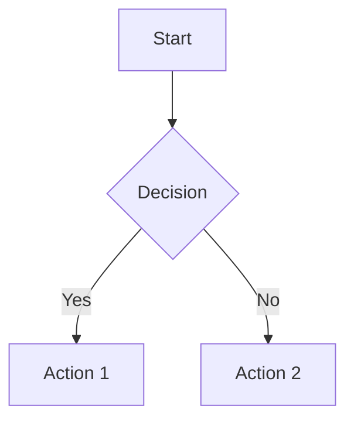

# ⚡ QUICK PDF-TO-MARKDOWN CONVERSION GUIDE
## TL;DR Version of the Ultimate Prompt

> **For when you need to convert fast and right**

---

## 🎯 THE 6 PHASES (One-Page View)

### **PHASE 1: EXTRACT & ASSESS** ⏱️ 30-60 min
```bash
# Extract everything
python extract_pdf.py --pdf source.pdf --output-text PDF_extracted_text.txt --output-images images/

# Build validator
python compare_pdf_md.py --pdf source.pdf --md output.md

# Create TODO tracker in output.md (top of file)
```

**Deliverables:** Full text file, all images extracted, validation tool, TODO section

---

### **PHASE 2: SYSTEMATIC CONVERSION** ⏱️ 2-4 hours
```markdown
## Method
1. Pick 2-3 sections from TODO
2. Extract from PDF_extracted_text.txt
3. Convert to Markdown with proper syntax
4. Update TODO with ✅
5. Commit with descriptive message
6. Repeat until 100%

## Commit Strategy
git commit -m "docs: add sections X, Y, Z - [completion%]"
```

**Deliverables:** 100% content in Markdown, 10-15 commits

---

### **PHASE 3: IMAGE OPTIMIZATION** ⏱️ 1-2 hours
```python
# Analyze all extracted images
python analyze_images.py --input images/ --output analysis.json

# Categories:
# DIAGRAM (> 200x150px, aspect 0.5-2.0) → KEEP
# LOGO_ICON (< 50KB, square) → KEEP 1-2
# HEADER_FOOTER (thin strips) → DELETE
# Review UNKNOWN manually

# Cleanup
python cleanup_unused_images.py --markdown output.md --images images/ --archive archive/
```

**Deliverables:** 3-10 essential images, 80-95% reduction

---

### **PHASE 4: VISUAL ENHANCEMENT** ⏱️ 2-3 hours
```markdown
## Add These
1. Quick Reference Table (all items at top)
2. Mermaid Diagrams (3-5):
   - Flowchart for complex logic
   - State diagram for modes
   - Pie chart for statistics
   - Graph for architecture
3. Code examples with syntax highlighting

## Mermaid Template

```

**Deliverables:** Enhanced document better than source PDF

---

### **PHASE 5: REPOSITORY OPTIMIZATION** ⏱️ 1 hour
```bash
# File structure
repo/
├── MAIN_DOCUMENT.md        # Your converted doc
├── README.md               # Comprehensive overview
├── LICENSE                 # MIT or appropriate
├── CONTRIBUTING.md         # How to contribute
├── .gitignore             # OS/editor files
├── images/                # Essential images only
└── archive/               # Development artifacts
    ├── scripts/
    ├── reports/
    └── extracted_images/

# Create files
cat > README.md << 'EOF'
# [Project Name]

## Overview
[What this documentation covers]

## Features
- ✅ Complete [X] coverage
- ✅ [Y] code examples
- ✅ Visual diagrams
- ✅ Quick reference tables

## Usage
[How to use this documentation]

## License
[Your license] - Original content © [Source]
EOF
```

**Deliverables:** Professional, public-ready repository

---

### **PHASE 6: DEPLOYMENT** ⏱️ 30 min
```powershell
# Create automation script (PowerShell example)
# push_to_github.ps1
param([string]$Username)

git remote add origin https://github.com/$Username/repo-name.git
git push -u origin main

Write-Host "✅ Deployed successfully!"
Write-Host "URL: https://github.com/$Username/repo-name"
```

**Deliverables:** One-command deployment

---

## 🔥 CRITICAL SUCCESS FACTORS

### **DO THIS:**
✅ Extract ALL content first (text + images)  
✅ Build validation tool in Phase 1  
✅ Update TODO after every section  
✅ Commit every 2-3 sections  
✅ Fix encoding issues immediately  
✅ Archive development files, don't delete  
✅ Optimize for target platform (Context7/GitHub)  

### **DON'T DO THIS:**
❌ Convert everything before first commit  
❌ Filter images before analyzing them  
❌ Wait until end to validate  
❌ Include PDF in final docs repo  
❌ Leave setup scripts in production  
❌ Use generic commit messages  
❌ Delete extracted images (archive them)  

---

## ⚡ SPEED RUN (Experienced Users)

```bash
# Phase 1 (10 min)
python -c "import fitz; doc=fitz.open('source.pdf'); [open('page%d.txt'%i,'w').write(doc[i].get_text()) for i in range(len(doc))]; doc.close()"
cat page*.txt > PDF_extracted_text.txt

# Phase 2 (2 hrs)
# Manual conversion + commits every 20 minutes

# Phase 3 (30 min)
find images/ -type f -exec file {} \; | grep -i "image" > image_list.txt
# Manual review, keep 3-10 essential

# Phase 4 (1 hr)
# Add 3 Mermaid diagrams + 1 reference table

# Phase 5 (20 min)
echo "# Project" > README.md
echo "MIT License" > LICENSE
echo "# Contributing" > CONTRIBUTING.md

# Phase 6 (5 min)
git init && git add -A && git commit -m "docs: complete conversion"
git remote add origin URL && git push -u origin main
```

**Total Time:** 4-5 hours for experienced users

---

## 📊 QUALITY CHECKLIST (Before Shipping)

```markdown
Quick validation (5 minutes):
- [ ] Validation tool shows 100% coverage
- [ ] No broken internal links
- [ ] Images load correctly
- [ ] Mermaid diagrams render on GitHub
- [ ] Code blocks have syntax highlighting
- [ ] README is complete
- [ ] LICENSE present
- [ ] Repository < 5 MB
- [ ] 10+ meaningful commits
```

---

## 🎯 METRICS CHEAT SHEET

| Metric | Good | Great | Elite |
|--------|------|-------|-------|
| **Completion** | 95% | 100% | 100% + enhancements |
| **Image Reduction** | 70% | 85% | 95%+ |
| **Repo Size** | < 10 MB | < 5 MB | < 1 MB |
| **Diagrams** | 1-2 | 3-5 | 6+ |
| **Code Examples** | 5+ | 10+ | 15+ |
| **Commits** | 5+ | 10+ | 20+ |
| **Time Investment** | 6-8 hrs | 4-6 hrs | < 4 hrs |

---

## 🛠️ MINIMAL TOOLSET

```bash
# Essential Python (one command install)
pip install PyMuPDF Pillow

# That's it! Everything else is optional.
```

---

## 💡 PRO TIPS

1. **Start simple, end fancy**: Phase 1-2 = functional, Phase 3-6 = exceptional
2. **TODO section is your GPS**: Update it or get lost
3. **Images lie**: 95% are formatting, not content - analyze first
4. **Commit like you'll forget**: Because you will
5. **Archive > Delete**: Future you will thank present you
6. **Mermaid = instant visual upgrade**: 30 min investment, 10x comprehension
7. **README compounds**: Best ROI of any file
8. **Purpose drives structure**: Context7 ≠ GitHub ≠ Internal docs

---

## 🚨 TROUBLE SHOOTING

### "My validation shows sections missing"
→ Search PDF_extracted_text.txt for section names  
→ Manual extraction if tool missed it  

### "Unicode errors everywhere"
→ Replace ✓✗ with [OK][NO] in all scripts  
→ Use ASCII fallbacks  

### "Too many images extracted"
→ Normal! 95% will be headers/footers  
→ Run analysis script, keep 5%  

### "Git repo is huge"
→ You included extracted images  
→ Move to archive/, recommit  

### "Conversion taking forever"
→ You're trying to be perfect in Phase 1  
→ Do ugly-but-complete first, polish later  

---

## 🎓 EXAMPLE OUTPUT

**Input:** Technical errata PDF, 35 pages, 176 images  
**Time:** 5 hours over 2 days  
**Output:**
- ✅ 1,380 lines Markdown
- ✅ 100% coverage (41 issues)
- ✅ 4 Mermaid diagrams
- ✅ 15 code examples
- ✅ 3 images (vs 176)
- ✅ 485 KB total size
- ✅ 15 commits
- ✅ Context7-ready

---

## 🔗 RESOURCES

- **Full guide:** `ULTIMATE_PDF_TO_MARKDOWN_PROMPT.md`
- **Mermaid docs:** https://mermaid.js.org/
- **Markdown guide:** https://www.markdownguide.org/
- **Context7:** https://context7.com/

---

## 🚀 ONE-LINER TO START

```bash
# Copy this, replace YOUR_PDF.pdf, and go:
mkdir conversion && cd conversion && python -c "import fitz; doc=fitz.open('YOUR_PDF.pdf'); open('text.txt','w').write(''.join([p.get_text() for p in doc])); [p.get_images() for p in doc]; print(f'Extracted {len(doc)} pages')" && echo "✅ Phase 1 started!"
```

---

**Built from real battle scars. Use it. Ship it. Improve it.** 🚀

*"Fast is slow and smooth. Smooth is fast." - Converted 1,380 lines in 5 hours*

